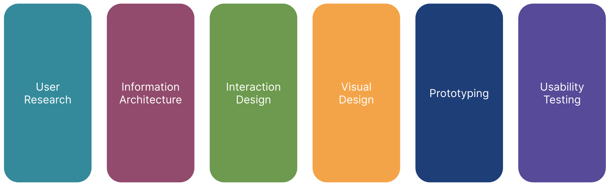

# Class 1: Introduction to User Experience Design (UXD)

## Welcome

Welcome to the User Experience Design (UXD) course! Over the course of this program, you'll dive into the world of UXD and learn how to design mobile applications that users not only like but also
love.

Our class meets twice a week, with each session lasting two hours. For details on class schedules and location, please refer to the [Overview](../../overview/README.md) page.

To make the most of this course, it's crucial to prepare for each week's lessons by thoroughly reviewing the module before each class. Active participation and success in the course depend on your
commitment to this preparation. Additionally, in-class exercises will contribute to your final grade, so be sure to attend.

## Learning Objectives

By the end of this week, you will:

- Understand the MAD9034 course: User Experience Design (UXD).
- Gain a high-level understanding of the UXD process.

## Slides

Access a PDF of the slides here: [MAD9034 1-1 UXD Overview](https://drive.google.com/file/d/1MDItB0m-LcPekvfr-v4Qm51kuNypOLbl/view?usp=drive_link).

## UX vs. UI

While often used interchangeably, User Interface (UI) and User Experience (UX) refer to distinct aspects of product or service design.

**User Interface (UI):** UI focuses on the visual and interactive elements users engage with directly, such as layouts, buttons, and forms. A well-designed UI aims to be intuitive and user-friendly,
enhancing navigation and interaction.

**User Experience (UX):** UX takes a holistic approach, considering the entire user journey. It encompasses emotional, psychological, and practical aspects of the experience. UX design aims to create
a meaningful interaction aligned with user needs and expectations.

In summary, UI deals with interface components, while UX addresses the broader user experience. Watch Don Norman's take on UX for further insights.

<YouTube
  title="Don Norman: The term UX"
  url="https://www.youtube.com/embed/9BdtGjoIN4E?si=-PaS2xXu_3a0cC_R"
/>

## What is UXD?

User Experience Design (UXD) enhances user satisfaction by improving usability, accessibility, and overall pleasure in user-product interactions. It extends traditional human-computer interaction
(HCI) design to address all aspects of user perception.

For a quick overview, watch What the #\$%@ is UX Design?

<YouTube
  title="What the #$%@ is UX Design?"
  url="https://www.youtube.com/embed/Ovj4hFxko7c?si=LWPGlzNstKo9wyTK"
/>

## Example

Imagine working for a software company focused on the end-to-end customer/user experience. This encompasses all interactions users have with the company, its services, and products:

1. Searching for a product to meet a need.
2. Browsing online, speaking to salespeople, or installing a trial.
3. The purchasing process.
4. Onboarding.
5. Product usage.

A positive user experience at each touchpoint fosters trust, loyalty, and advocacy.

## Types of User Experiences

User experiences can vary:

- **Memorable:** Leaves a lasting impression.
- **Intuitive:** Aligns with user expectations.
- **Negative (intentional):** Motivates users.
- **Negative (unintentional):** Generates unexpected feelings.

## UX Design Process

Learn more about the UX design process in [Design Thinking 101](https://www.nngroup.com/articles/design-thinking/). This process follows:

1. Understand
2. Explore
3. Materialize

Within these phases are 6 key steps: empathize, define, ideate, prototype, test, and implement.

**Empathize**

Understand users by studying their actions, words, thoughts, and feelings. Observe them in real situations to gain insights.

**Define**

Collect research findings and identify user problems, spotting opportunities for new ideas.

**Ideate**

Brainstorm creative ideas to address unmet user needs.

**Prototype**

Create tangible representations of ideas to understand what works and what doesn't.

**Test**

Put prototypes in front of users to verify if goals are achieved.

**Implement + Measure**

Put the UX vision into effect, ensuring it enhances users' lives.

### Tools and Deliverables (covered in this course)

- Personas
- Scenarios
- Information Architecture
- Wireframes
- Visual design
- Prototype
- Usability testing

## UX Design Competencies

Explore the [Five Competencies of User Experience Design](https://www.uxmatters.com/mt/archives/2007/11/the-five-competencies-of-user-experience-design.php).

**Remember:** Before building a mobile app, verify the viability of your idea and its alignment with user needs. A User-Centered Design approach will help create the best product experience and
fulfill your business objectives effectively.
