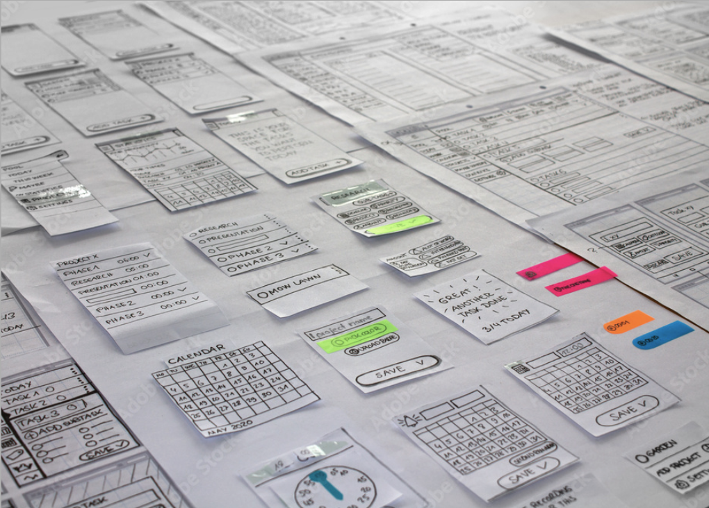

# Week 10: Prototyping and Concept Testing

::: warning Required Preparation
For optimal engagement and understanding, please review this module before class.
:::

## Learning Objectives

- Understand the importance and benefits of prototyping in the design process.
- Differentiate between validation and evaluation in concept testing.
- Recognize various fidelity levels of prototypes and when to use each.
- Identify the tools and methods suitable for different stages of prototyping.

## Slides

Coming Soon

## Prototyping

A **prototype** is an early model or sample built to test a concept or process.

**Goals of Prototyping:**

- Test a design hypothesis.
- Learn, improve, and gain confidence in a product or idea before investing time and money in the full implementation.

### The Value of Prototyping

- Early changes are easier and less costly to make.
- Enables refining of design elements before the final version.

### Validation vs. Evaluation

- **Validating** a design introduces bias; it may discourage users from pointing out issues.
- **Replace "validate" with**: test, research, evaluate, examine, study, analyze, watch how people use, see where the design succeeds and fails.

### What Can You Test with a Prototype?

- **Usability**: Layout, affordance/feedback, terminology.
- **Navigation**: Ensure users can navigate effectively.
- **Functionality**: Ensure interactive elements support user tasks.
- **Alternate Designs**: Determine most user-preferred options.

## Types of Prototyping

|         Paper Prototype         |          Digital Prototype          |                     Dev Prototype                     |
| :-----------------------------: | :---------------------------------: | :---------------------------------------------------: |
|       Early design stage        |          Any design stage           | Test complex designs   before final implementation |
|  |  |                            |

## Levels of Fidelity in Prototyping

Prototypes can vary in their detail and realism. Choosing the right fidelity depends on the goals, audience, and stage of the design.

### 1. Low Fidelity

- Used early in the design process.
- Quick, easy, and iterative.
- Test assumptions and identify major problems.

### 2. Mid Fidelity

- Refines solutions tested in low fidelity.
- Tests finer details and specific interactions.
- Static wireframes.
- Partially interactive digital interfaces.

### 3. High Fidelity

- Closely represents the final product.
- Used for the last line of testing before actual development.
- Pixel-perfect designs.
- Real working code with simulated interactions.
- Actual content and visual design.

## Tools for Prototyping

## Concept Testing

Concept testing captures the key essence (the value proposition) of a new product or service concept to understand if it meets the needs of the target audience.

### Early Stage Concept Testing

- Connecting with users.
- Communicating effectively with users.
- Identifying user responses.
- Gauging user interpretations of designs.
- Testing multiple design concepts.

### Advanced Stage Concept Testing

- Observing user interactions with on-screen elements.
- Refining content, interactive elements, and overall sequences.
- Testing multiple microinteraction solutions.

### Testing Prototypes

Here is a help article which looks at [testing](https://www.interaction-design.org/literature/article/stage-5-in-the-design-thinking-process-test) in more detail.

#### Early Design Stages

Low-fidelity prototypes allow for testing:

- Concepts.
- Understanding problems.
- Identifying 'blind spots'.
- Gauging the scope of solutions.

<YouTube
  title="Paper Prototyping: How to Create & Usability-Test Simple UI Prototypes (40 min tutorial)"
  url="https://www.youtube.com/embed/OlbdIXLunt4?si=2wSMlKS2kmZG0SAH"
/>

#### Advanced Design Stages

Higher fidelity prototypes help test:

- Usability.
- Content relevance and clarity.
- Efficiency.
- Desirability.

### User Research Methods

It aids design iterations, leading to:

- A deeper empathy and understanding of users.
- Insights that might redefine your problem statement.
- New solution ideas.
- Design and prototype improvement.

### Preparation and Execution

To maximize concept testing benefits:

1. **The Prototype**

   - Remember, the prototype is under test, not the user.
   - Design the prototype with a specific question in mind.

2. **Context and Scenario**

   - Focus on the primary use-case scenario.

3. **User Interaction**

   - Set user expectations about the prototype and the test.
   - Avoid diving into prototype operation details.

4. **Observation and Feedback Capture**
   - Ensure the user's interaction is uninterrupted.
   - Record significant observations.

### Testing a Paper Prototype

<YouTube
  title="Usability Test with a Paper Prototype"
  url="https://www.youtube.com/embed/dNbh21-G_cQ?si=F7upesADu6QLjYzM"
/>

1. **Recruit Users**

   - Seek representative users.
   - Testing with 5 users typically identifies most problems.
   - Use 'hallway testing' if recruiting is challenging.

2. **Setup**

   - Use a neutral, quiet environment.
   - Have adequate space and seating.
   - Include a facilitator, "product" operator, and ideally, a note-taker.

3. **Conducting Sessions**
   - Begin with an introduction.
   - Guide users through tasks.
   - Observe without intervening.
   - Engage in post-test discussions.

### Guidelines for Interpreting Results

- Stick to observed facts.
- Relate feedback to initial research questions.
- Note answered and unanswered questions.
- Be prepared for new questions to emerge.
- Remember: Testing is iterative. Each round brings clarity.
