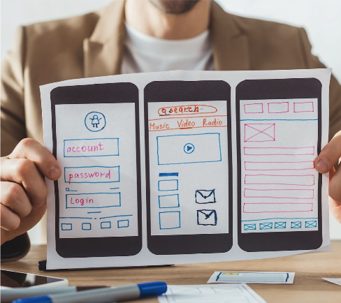

# Week 10: Prototyping and Concept Testing

::: warning Required Preparation
For optimal engagement and understanding, please review this module before class.
:::

## Learning Objectives

- Understand the importance and benefits of prototyping in the design process.
- Differentiate between validation and evaluation in concept testing.
- Recognize various fidelity levels of prototypes and when to use each.
- Identify the tools and methods suitable for different stages of prototyping.

## Slides

[Link to slides for this week's lessons](#)

## Prototyping

A **prototype** is an early model or sample built to test a concept or process.

**Goals of Prototyping:**

- Test a design hypothesis.
- Learn, improve, and gain confidence in a product or idea before investing time and money in the full implementation.

### The Value of Prototyping

- Early changes are easier and less costly to make.

### Validation vs. Evaluation

- **Validating** a design introduces bias; it may discourage users from pointing out issues.
- **Replace "validate" with**: test, research, evaluate, examine, study, analyze, watch how people use, see where the design succeeds and fails.

### What Can You Test with a Prototype?

- **Usability**: Layout, affordance/feedback, terminology.
- **Navigation**: Ensure users can navigate effectively.
- **Functionality**: Ensure interactive elements support user tasks.
- **Alternate Designs**: Determine most user-preferred options.

## Types of Prototyping

|         Paper Prototype         |          Digital Prototype          |                     Dev Prototype                     |
| :-----------------------------: | :---------------------------------: | :---------------------------------------------------: |
|       Early design stage        |          Any design stage           | Test complex designs   before final implementation |
|  |  |                            |

## Levels of Fidelity in Prototyping

Prototypes can vary in their detail and realism. Choosing the right fidelity depends on the goals, audience, and stage of the design.

### 1. Low Fidelity

- Used early in the design process.
- Quick, easy, and iterative.
- Test assumptions and identify major problems.

**Types of Low-Fidelity Prototypes:**

- Rough sketches.
- Paper models.
- Simple storyboards.
- Rough digital interfaces.

### 2. Mid Fidelity

- Refines solutions tested in low fidelity.
- Tests finer details and specific interactions.

**Details:**

- Static wireframes.
- Partially interactive digital interfaces.

**Example:** Testing a complex form or search function.

### 3. High Fidelity

- Closely represents the final product.
- Used for the last line of testing before actual development.

**Details:**

- Pixel-perfect designs.
- Real working code with simulated interactions.
- Actual content and visual design.

### Choosing a Fidelity Level

- Consider **time and budget**: Lower fidelity is faster and cheaper.
- **Focus on what you want to test**: Avoid distracting elements that you're not ready to evaluate.

|                                                    Low Fidelity                                                    |                                                                      Mid Fidelity                                                                       |                                                           High Fidelity                                                            |
| :----------------------------------------------------------------------------------------------------------------: | :-----------------------------------------------------------------------------------------------------------------------------------------------------: | :--------------------------------------------------------------------------------------------------------------------------------: |
| It’s likely that any project has assumptions or unanswered questions. Always test your general solution/direction. | Identify specific questions to answer about the execution of your chosen solution such as specific interaction methods, or workflows through key tasks. | Use when questions remain which can be answered more easily with a prototype than by planning to build the final product & refine. |

[Read more: UX Prototypes: Low Fidelity vs. High Fidelity](https://www.nngroup.com/articles/ux-prototype-hi-lo-fidelity/)

**Do you need a prototype for every fidelity level?** Each prototype should answer a specific design question.

## Tools for Prototyping

