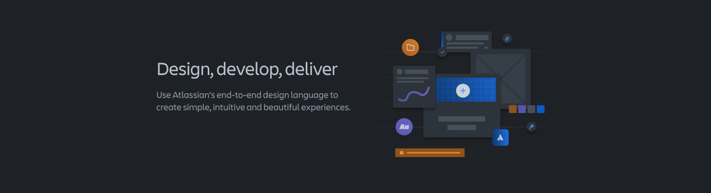

# Week 11: Digital Wireframes & Working with Risks and Unknowns

## Required Preparation

::: warning
Please review this module before class for optimal engagement and understanding.
:::

## Learning Objectives

- Understand the differences and significance of concept and detailed design in digital product development.
- Master navigation finalization, screen layout creation, control/component selection, and effective use of icons and labels.
- Apply suitable typography and visual design for readability, aesthetics, and brand alignment.
- Utilize key design guidelines from systems like Google's Material Design and Apple's Human Interface Guidelines.
- Identify and strategize against various risks (market, product, usage) in digital design.
- Enhance skills in managing uncertainty and ambiguity, promoting innovation and resilience.
- Grasp Lean UX principles, focusing on rapid experimentation and customer testing, and contrast these with traditional UX methods.
- Collaborate effectively in cross-functional teams, employing Lean UX and Agile methodologies for optimized design processes.

## Slides

[MAD9034 11-1 Digital Wireframing](https://docs.google.com/presentation/d/1eTfVljq1rlvYnpX0X-ggSRAX8HKkMs9xnRwZEQWEB-k/edit?usp=sharing)

[MAD9034 11-2 Working with Risks and Unknowns](https://docs.google.com/presentation/d/1Z41EV6xg4gw4-oqn64Fdv59HXlsDMbTge75BcEjKxu0/edit?usp=sharing)

## Detailed Design

**Summary**: Detailed design is the process of refining and specifying all the elements of a product's interface. It involves finalizing the layout, controls, icons, typography, and visual design to ensure a cohesive and functional user experience.

### Concept Design vs Detailed Design

|                                           Concept Design                                            |                                        Detailed Design                                        |
| :-------------------------------------------------------------------------------------------------: | :-------------------------------------------------------------------------------------------: |
| Focuses on the application framework, structure, navigation, flows, and information prioritization. | Involves screen layouts, controls & components, icons, labels, typography, and visual design. |

#### Components of Detailed Design

- Finalize navigation and overall framework/structure.
- Design screen layouts.
- Specify controls & components.
- Choose icons and labels.
- Select typography.
- Implement visual design.

#### Navigation and Framework

<DetailsCard imageSrc=/f2023/moduleImages/week11/navigation.png>

- Finalize navigation and ensure consistency across the product.
- Define persistent elements like application headers and other UI elements.
- Consider empty pages as opportunities for instructions or links.

</DetailsCard>

#### Screen Layouts

<DetailsCard imageSrc=/f2023/moduleImages/week11/layouts.png>

- Transition from lo-fi prototypes to detailed screen designs.
- Define UI elements for each screen and their consistency across the application.
- Consider validations, warning, and error messages.

</DetailsCard>

#### Controls and Components

<DetailsCard imageSrc=/f2023/moduleImages/week11/controls.png>

- Design UI elements based on detailed layout designs.
- Choose appropriate controls and components (e.g., buttons, tabs, menus).
- Consult UI guidelines like Google Material Design or Atlassian Design System ([Atlassian Design](https://atlassian.design/)).
- Focus on reusable components.

</DetailsCard>

#### Icons, Labels

<DetailsCard imageSrc=/f2023/moduleImages/week11/icons.png>

- Enhance usability with appropriate icons and clear labels.
- Ensure icons add clarity and labels are appropriate for your personas.
- Consider localization and the potential need for text expansion.

</DetailsCard>

#### Typography

<DetailsCard imageSrc=/f2023/moduleImages/week11/typography.png>

- Select typefaces and font sizes for different text elements.
- Create reusable typography components (e.g., H1, H1 Bold, Regular).
- Resources:
  - [The Right Way to Use Fonts in Mobile Apps](https://promatics.medium.com/the-right-way-to-use-fonts-in-mobile-apps-c9677483a8bd)
  - [Ellen Lupton](https://ellenlupton.com/)
  - [Apple Fonts](https://developer.apple.com/fonts/)
  - [Material Design The Type System](https://m2.material.io/design/typography/the-type-system.html#type-scale).

</DetailsCard>

#### Visual Design

<DetailsCard imageSrc=/f2023/moduleImages/week11/VisualDesign.png>

- Add color and style as the final layer of design.
- Choose an appropriate color scheme and style elements considering product branding.
- Resources:
  - [Web Design Colour Trends in 2023](https://www.linkedin.com/pulse/web-design-colour-trends-2023-enhancing-user-experience-visual/)
  - [Color Schemes for Apps](https://www.uxpin.com/studio/blog/color-schemes-for-apps/).

</DetailsCard>

## Design Guidelines

### Material Design

- Material is a design system created by Google to help teams build high-quality digital experiences for Android, iOS, Flutter, and the web.
- Latest version: [Material Design 3](https://material.io/design).

### Human Interface Guidelines

- The HIG contains guidance and best practices that can help you design a great experience for any Apple platform.
- [Apple's Human Interface Guidelines](https://developer.apple.com/design/human-interface-guidelines/).

### Atlassian Design System

- Use Atlassian's end-to-end design language to create simple, intuitive and beautiful experiences.
- [Atlassian Design System](https://atlassian.design/).

### Benefits of Using Design Guidelines

- Provides a reliable source of information and best practices.
- Ensures familiarity and ease of use for your application.
- Encourages creativity within the bounds of user expectations.

### Best Practices

- Maintain consistency.
- Include shortcuts for power users.
- Provide meaningful feedback and status indicators.
- Plan for and handle errors effectively.
- Allow easy reversal of actions.
- Give users control and reduce demands on short-term memory.

## Risks and Unknowns

### All Stages of the Process

Even with ample time and resources, unknowns or changes are inevitable from the research completion to the product release. Adaptability and agility are crucial, accepting that some aspects will only be validated once the product is in users' hands.

- Unknowns exist at all levels of the process.
- Initial research often uncovers more questions.
- Operate with assumptions and hypotheses, validating them through analysis and user feedback.
- Design phase uncertainties persist even after prototyping and user testing.
- Prototyping typically covers only parts of the application, leaving some areas untested.
- Each testing cycle clarifies some questions but may also introduce new ones.

**Key Areas:**

- **Research**: Gaps in understanding, risks in user needs.
- **Analysis**: Hypotheses are uncertain and need validation.
- **Design**: Unknowns about product implementation and user interaction.
- **Prototype**: Inability to test everything.
- **Testing**: Clarification and emergence of new unknowns.

### Working with Uncertainty

Uncertainty in UX design can stem from unclear requirements, time constraints, resource limitations, or changes in market, technology, user needs, and business priorities.

"Uncertainty is the state of not knowing or being able to predict the outcome or consequences of an action or decision."

**Tips on Embracing Uncertainty:**

- Embrace ambiguity as an opportunity for innovation and exploration.
- Manage uncertainty as a source of learning and improvement.
- Foster collaboration to define common goals and embrace uncertainty together.
- Develop resilience by viewing potential failures as learning opportunities.
- Resources:
  - [How do you deal with ambiguity and uncertainty in design thinking processes?](https://www.linkedin.com/advice/1/how-do-you-deal-ambiguity-uncertainty-design)
  - [How can you evaluate UX design when faced with uncertainty and ambiguity?](https://www.linkedin.com/advice/0/how-can-you-evaluate-ux-design-when-faced)

### How to Identify Risks

- **Market Risks**: Evaluate market needs and competitive landscape. Consider new product initiatives and their market viability.
- **Product Risks**: Assess if the product delivers customer value, its MVP status, and competitive advantage.
- **Risks in Use**: Document potential user errors and their consequences, like security issues or data loss.

Mitigation involves thorough market research, user research, ideation, prototyping, and testing. Be ready to pivot and adapt to changes in technology and market.

### Working with Risks

#### Market Risks

<DetailsCard imageSrc=/f2023/moduleImages/week11/valueProposition.png>

- Use tools like the [Value Proposition Canvas](https://www.strategyzer.com/library/the-value-proposition-canvas) for market need evaluation and competitive analysis.
- Collaborate with Product Marketing for insights into market risks.
- Organize focus groups, build prototypes, and conduct usability testing.

</DetailsCard>

#### Product Risks

<DetailsCard imageSrc=/f2023/moduleImages/week11/productRisks.png>

- Assess design, value, usability, feasibility, and viability risks.
- Conduct customer interviews, market analysis, and review mining.
- Engage in QA processes, test with real data, and consider accessibility.
- Discuss technical aspects with the team, considering quality attributes and system integration.

</DetailsCard>

#### Lean UX

<YouTube
  title="What is Lean UX?"
  url="https://www.youtube.com/embed/Y_C9jKXUVnE?si=HNVbp9SlFcUPHty4"
/>

**Definition and Benefits:**

> “Lean UX is a collaborative, cross-functional design approach that establishes the true nature of a product in a fast, user-centered way.”

**Goals and Benefits:**

- Maximize value and minimize waste in software design.
- Based on the principle: think > make > check.

**Reducing Risks with Lean UX:**

<DetailsCard imageSrc=/f2023/moduleImages/week11/reducingRisks2.png>

- Emphasize rapid customer testing to reduce product risk.
- Engage customers/users at all stages of product design and delivery.
- Validate design concepts early and continuously.
- Resources:
  - [Lean UX is about reducing risks](https://medium.com/@drewmck/lean-ux-is-about-reducing-risk-1d7d505d2881)
  - [Lean UX and Agile](https://www.nngroup.com/articles/lean-ux-agile-study-guide/)

</DetailsCard>

**Difference between Lean UX and Traditional UX:**

|                                     Lean UX                                     |                                                       Traditional UX                                                       |
| :-----------------------------------------------------------------------------: | :------------------------------------------------------------------------------------------------------------------------: |
|                              Rapid experimentation                              |                               It involves more deliverables and documentation of each phase                                |
| Small, incremental testing to assess the assumptions around a design hypothesis | Comprehensive research, analysis, ideation, prototyping and testing to ensure the product meets the users’ needs very well |
|              It requires extensive cross-functional collaboration               |

For further reading:

- [Lean UX and Agile: Study Guide](https://www.nngroup.com/articles/lean-ux-and-agile/)
- [What is Lean UX and Why Does It Matter?](https://uxdesigninstitute.com/blog/what-is-lean-ux/)
