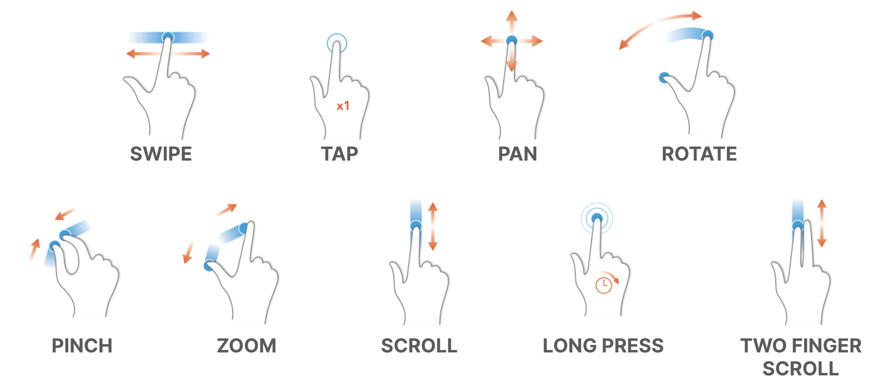

# Week 12: From Low-Fidelity to High-Fidelity: Crafting Interactive Prototypes through Visual Design

## Required Preparation

::: warning
Please review this module before class for optimal engagement and understanding.
:::

## Learning Objectives

- Recognize how visual design goes beyond aesthetics to shape and enhance user experiences through the integration of various design elements.
- Learn why visual design is crucial in focusing attention, shaping user experience, and enhancing content.
- Understand the differences and unique roles of visual design and graphic design in digital and print media.
- Gain knowledge about the basic elements such as line, shape, negative/white space, value, color, and texture, and their application in creating effective designs.
- Utilize principles like unity, hierarchy, balance, contrast, scale, and dominance to create visually cohesive and user-friendly designs.
- Understand and apply Gestalt principles to predict and influence how users perceive and interpret visual elements as a cohesive whole.
- Use the knowledge of visual design principles and elements to enhance the development of interactive prototypes, ensuring they are not only functional but also visually appealing and intuitive.
- Improve the ability to communicate ideas and concepts visually, using design elements and principles effectively.

## Slides

[MAD9034 12-1 Visual Design](https://drive.google.com/file/d/194icHQvxaBNG6vmwmi2Y7Wjm3TTrstmi/view?usp=sharing)

## Understanding Visual Design

Visual design transcends mere aesthetics, playing a pivotal role in shaping and enhancing user experiences. It's not just about making products look attractive; it's about thoughtful integration of elements like illustrations, photography, typography, space, layout, and color to make products both usable and appealing.

Imagine visual design as the final layer in a multi-tiered cake of design. It's not merely a superficial coat of paint; it's the culmination of a design process that gives your product a distinct, recognizable identity.

### The Significance of Visual Design

Visual design is crucial because it:

- **Centers and Enhances Content:** It ensures that the content is the focal point, augmenting it to engage users and build trust and interest.
- **Shapes User Experience:** By strategically arranging visual elements, it guides user responses and behaviors, aligning them with the product's purpose.
- **Focuses Attention:** It eliminates confusion, ensuring that UI elements are harmonious and attention is directed appropriately, whether towards content or actions.

### Objectives of Visual Design

- **Enhancing User Experience:** Utilize design elements to make products intuitive, user-friendly, and enjoyable.
- **Creating Visual Harmony:** Employ principles like balance, contrast, and unity for visual cohesion.
- **Establishing Brand Identity:** Leverage design to reinforce brand messaging and establish a strong visual presence.
- **Ensuring Accessibility:** Design inclusively, making visual elements accessible to all users, including those with disabilities.
- **Improving Usability:** Enhance navigation and comprehension through strategic layout, typography, and spacing.
- **Emphasizing Key Information:** Use visual hierarchy and scale to highlight crucial information or actions.

### Visual Design vs. Graphic Design

| **Visual Design:**                                                                                                                                                                                                                              | **Graphic Design:**                                                                                                                                                                                                                  |
| ----------------------------------------------------------------------------------------------------------------------------------------------------------------------------------------------------------------------------------------------- | ------------------------------------------------------------------------------------------------------------------------------------------------------------------------------------------------------------------------------------ |
| Focuses on optimizing user experience in digital spaces, using elements like typography and color to enhance interaction and usability. It's intertwined with functionality and user journey, emphasizing intuitive design in digital contexts. | Involves creating visual content for various media, using imagery and typography to communicate messages and solve problems. It spans digital and print mediums, often focusing more on artistic expression and visual storytelling. |

### Fundamental Elements of Visual Design  

<DetailsCard imageSrc=/f2023/moduleImages/week12/Line.png>

**Line**

- **Definition:** A line connects two points and can be used to define shapes, indicate movement, and create texture.
- **Application:** Lines can guide the viewer's eye around a composition, or they can be used to create a sense of movement and dynamism. The weight, style, and direction of a line can also convey different moods and emotions.
- **Importance:** Lines are fundamental in creating structure and form within a design. They can be used to separate or connect elements, leading the viewer's eye and influencing how information is perceived.

</DetailsCard>

<DetailsCard imageSrc=/f2023/moduleImages/week12/Shape.png>

**Shape**

- **Definition:** Shapes are defined areas created by lines or contrasts in color and value. They can be geometric (like squares and circles) or organic (free-form or natural shapes).
- **Application:** Shapes are used to create a sense of space and substance in a design. They can be used to draw attention, group elements, convey meaning, and create impact.
- **Importance:** Shapes are essential for creating visual interest and hierarchy. They help to organize elements on a page by grouping similar items and separating others, aiding in the overall comprehension of the design.

</DetailsCard>

<DetailsCard imageSrc=/f2023/moduleImages/week12/NegativeSpace.png>

**Negative/White Space**

- **Definition:** Negative space, or white space, is the unmarked space between and around the elements of a design.
- **Application:** It can be used to create visual breathing room for the eye; it helps to balance out a design and can be used to lead the viewer's eye to various focal points.
- **Importance:** Negative space is crucial for a clean and clear design. It prevents a design from becoming too cluttered or overwhelming, ensuring that the viewer can easily process the information presented.

</DetailsCard>

<DetailsCard imageSrc=/f2023/moduleImages/week12/Value.png>

**Value**

- **Definition:** Value refers to the lightness or darkness of a color.
- **Application:** It can create depth and contrast in a design, highlighting or obscuring elements.
- **Importance:** Value is important for creating mood and atmosphere in a design. It can bring attention to certain elements, aiding in visual storytelling and the overall aesthetic appeal.

</DetailsCard>

<DetailsCard imageSrc=/f2023/moduleImages/week12/Colour.png>

**Color**

- **Definition:** Color is an element of light. Different colors can evoke different emotions and reactions.
- **Application:** Color can be used to attract attention, group elements, convey meaning, and enhance aesthetics. The choice of colors can significantly affect the mood and usability of a design.
- **Importance:** Color is one of the most powerful tools in a designer's toolkit. It can transform a design, create an atmosphere, and communicate messages and emotions effectively.

</DetailsCard>

<DetailsCard imageSrc=/f2023/moduleImages/week12/Texture.png>

**Texture**

- **Definition:** Texture refers to the surface quality of an object, which can be seen or felt.
- **Application:** Texture can be used in a design to add depth and dimension, creating a more dynamic and tactile experience.
- **Importance:** Texture adds richness and visual interest to a design. It can enhance the user experience by providing a more relatable and realistic feel to the design elements.

 </DetailsCard>

### Principles of Visual Design

Visual design principles are the cornerstone of creating aesthetically pleasing and functionally effective designs. Understanding and applying these principles is key to successful design work. Find more in-depth information from [Invision on Principles of Visual Design here](https://www.invisionapp.com/defined/principles-of-design)

<YouTube
  title="Understanding Visual Design Principles"
  url="https://www.youtube.com/embed/yNDgFK2Jj1E?si=EPZ84Nr9T67PwRde"
/>

Watch the video above for more information on visual design principles, also check out this video that examines some websites and how they use these principles [Complete Layout Guide(4:54)](https://youtu.be/MlsV3hu84as?si=TV3gTkGPGXlGt6UY)

 

<DetailsCard imageSrc=/f2023/moduleImages/week12/unity.jpg>

#### Unity

- **Definition:** Unity refers to the cohesiveness of a design, creating a sense of harmony among all elements.
- **Application:** Achieve unity by using consistent elements and styles, such as similar color schemes, typographic details, and graphical elements. This consistency helps different parts of the design feel like part of a whole.
- **Importance:** Unity is crucial for maintaining a coherent and cohesive visual language in a design, ensuring that all parts of the design work together seamlessly.

</DetailsCard>

<DetailsCard imageSrc=/f2023/moduleImages/week12/hierarchy.jpg>

#### Hierarchy

- **Definition:** Hierarchy is the arrangement of elements in a way that implies importance.
- **Application:** Use size, color, contrast, and placement to draw attention to key elements. Larger, bolder, and more centrally placed elements typically attract more attention and are perceived as more important.
- **Importance:** Effective hierarchy guides the viewer’s eye to the most important information first, making the design not only aesthetically pleasing but also functionally efficient.

</DetailsCard>

<DetailsCard imageSrc=/f2023/moduleImages/week12/balance.jpg>

#### Balance

- **Definition:** Balance involves distributing elements so that the design feels stable and aesthetically pleasing.
- **Application:** This can be achieved through symmetry (mirroring elements) or asymmetry (distributing elements of differing sizes and shapes). Balance doesn’t necessarily mean equal distribution; it’s about creating a visual equilibrium.
- **Importance:** Balance is key to preventing parts of the design from overwhelming others, ensuring that no single part of the design overpowers the rest, but rather complements it.

</DetailsCard>

<DetailsCard imageSrc=/f2023/moduleImages/week12/contrast.jpg>

#### Contrast

- **Definition:** Contrast is the difference between elements in a design, particularly in color and value.
- **Application:** Use contrasting colors, sizes, shapes, and textures to make elements stand out and to add interest and variety to the design.
- **Importance:** Contrast is essential for legibility and emphasis. It helps to make the important elements 'pop' and can guide the viewer’s attention to specific areas of the design.

</DetailsCard>

<DetailsCard imageSrc=/f2023/moduleImages/week12/scale.jpg>

#### Scale

- **Definition:** Scale refers to the relative size of elements in a design.
- **Application:** Adjusting the scale of different elements can create focal points and help organize information. Larger elements are more likely to draw attention than smaller ones.
- **Importance:** Scale can be used to create a visual hierarchy, guide the viewer’s attention, and convey the significance of different elements.

</DetailsCard>

<DetailsCard imageSrc=/f2023/moduleImages/week12/emphasis.jpg>

#### Dominance (Emphasis)

- **Definition:** Dominance focuses on prioritizing one element over others to draw attention.
- **Application:** This can be achieved through contrasting size, color, shape, or texture. The dominant element should be the focal point and most visually striking part of the design.
- **Importance:** Dominance creates a focal point in your design, guiding viewers’ attention to the most important part of your message.

</DetailsCard>

#### Gestalt Principles

- **Definition:** Gestalt Principles are based on the idea that the human brain will attempt to simplify and organize complex images or designs that consist of many elements, by subconsciously arranging the parts into an organized system that creates a whole, rather than just a series of disparate elements.

- **Application and Importance:**

  - **Proximity:** Elements that are close together are perceived to be more related than elements that are spaced farther apart. By grouping related items together, you can indicate that they have something in common, which helps create a clean and organized design.
  - **Similarity:** When objects look similar to one another, people often perceive them as a group or pattern. This principle can be used to create cohesion in a design and to guide the viewer’s attention to areas of importance.
  - **Closure:** The human mind's tendency to see complete figures even when part of the information is missing. Designers can use this principle to create designs that are visually intriguing and that the viewer’s mind will complete.
  - **Figure/Ground:** This principle deals with the human eye’s tendency to see and separate objects from their surrounding background. Designers can manipulate which elements are perceived as the focal point and which are seen as the background.
  - **Continuity:** The principle that the eye is drawn to follow lines or shapes beyond their ending point. This can be used to guide the viewer’s attention through a design and to create a sense of movement or flow.
  - **Symmetry and Order:** The human eye perceives symmetrical shapes as belonging together, regardless of their distance. Symmetry provides a sense of order and can be used to create balance, harmony, and a sense of stability in a design.

- **Overall Importance:** Gestalt principles are essential in design because they help designers to understand and predict how viewers will perceive and interpret their designs. By effectively using these principles, designers can create more intuitive, comprehensible, and visually appealing designs that communicate messages more effectively and improve the user experience.

By mastering these elements and principles, you can create effective and engaging visual experiences that enhance your interactive prototypes.

## Animation, transitions and interactivity

### Animations: What are they?

- Animation (sometimes referred to as motion) is any element that moves on your screen. This can include:
- Moving from one place to another
- Fading, rotating, scaling, etc.

### The Purpose of Animation

Animations serve multiple functions in user interface design:

- **Orientation and Navigation:** They help in creating a visual map of the application's architecture, making navigation more intuitive.
- **Feedback and Status:** Animations can indicate the progress of a task, such as a loading spinner, or confirm an action, like a checkmark after a form submission.
- **Education and Guidance:** They can guide new users through a product's features and functionalities in an engaging way.
- **Character and Mood:** Animations infuse personality into a product, enhancing the emotional connection with users.

#### Orientation and Navigation

Animations can simplify complex navigation paths and make transitions between different app sections smoother and more understandable.

#### Feedback and Status

Animations like progress bars and loading indicators inform users about ongoing processes, reducing uncertainty and improving the overall user experience.

#### Education and Guidance

Step-by-step animations can effectively onboard new users, demonstrating how to navigate and use the app's features.

#### Character and Mood

Subtle animations can significantly enhance the mood of the app, making interactions more enjoyable and engaging.

**Example:** Different animations can also be used to create different moods or energy.

**Meditation App**

- Uses slow, smooth animations to convey calm and peace.

### Transitions: Creating Seamless User Flows

Transitions in UI design are not just about moving from one screen to another; they're about maintaining context and creating a seamless flow.

#### Transition Patterns

1. **Container Transform:** Helps maintain user focus by transforming an element’s container as the user navigates through the app.
2. **Forward and Backward:** Ensures users understand their location within the app’s navigation hierarchy.
3. **Lateral:** Used for navigating between items at the same hierarchical level.
4. **Top Level:** Transitions between primary sections of an app.
5. **Enter and Exit:** Used for bringing elements or screens into focus and moving out of focus.
6. **Skeleton Loaders:** Provide an immediate response with a placeholder while the content is loading, improving perceived performance.

### Interactivity: Beyond Basic Touch Gestures

Interactivity in apps is not limited to touch gestures; it encompasses a range of interactions that make an app more engaging and easier to use.

#### Types of Gestures

- **Navigational Gestures:** Such as swipe to navigate between pages or pull down to refresh, make navigation feel more natural.
- **Action Gestures:** Like double-tap to like or long-press to open additional options, add shortcuts for frequent actions.
- **Transform Gestures:** Enable users to interact directly with the content, like pinch to zoom or rotate to change orientation.

#### Advanced Interactivity

- **Voice Commands:** Allowing hands-free control and accessibility.
- **Motion Sensors:** Utilizing device orientation or movement for interaction.
- **Proximity Sensors:** Enabling actions based on the user's physical proximity to the device.

### Micro-interactions: The Power of Small Details

Micro-interactions are brief, but they significantly influence the user experience by making it smoother and more intuitive.

**Advanced Uses of Micro-interactions:**

- **Progressive Disclosure:** Revealing more options or information as needed, reducing initial cognitive load.
- **Error Prevention:** Providing immediate feedback on user input, preventing errors before they happen.
- **Rewarding Engagement:** Offering subtle animations or changes as rewards for user engagement, enhancing satisfaction.

**Designing Effective Micro-interactions:**

- **Context-Aware:** Should be relevant to the current user task or action.
- **Subtle Yet Informative:** Provide enough information without overwhelming the user.
- **Enhancing, Not Distracting:** Aim to improve the user experience, not detract from it.

By thoughtfully incorporating animations, transitions, and interactivity, designers can create more engaging, intuitive, and user-friendly apps.
