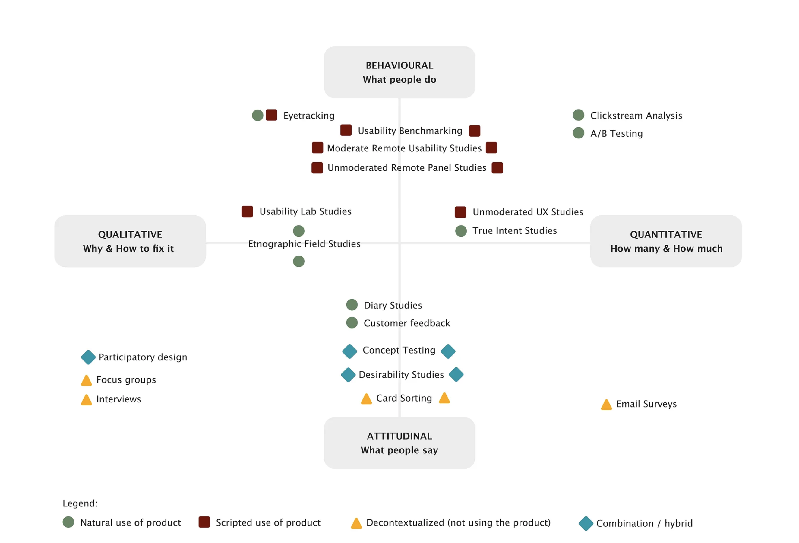
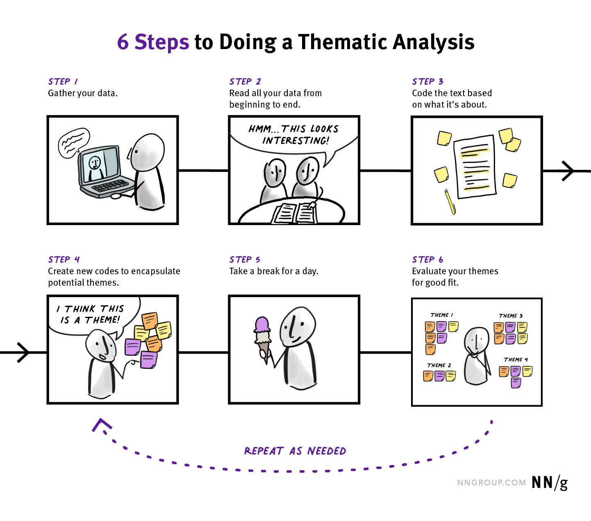

# Research and Analysis Overview 

::: warning Preparation Required

To maximize your engagement and success in the course, it is crucial to thoroughly review the weekly module before each class. Your active participation depends on diligently meeting this preparation requirement, ensuring you are fully informed and ready to contribute to discussions and activities.
:::

## Learning Objectives

By the end of this week, students will:

- Have a deeper understanding of the role of research in the UXD process.
- Have learned and practiced some research skills using appropriate tools.
- Understand the goals and importance of user research analysis.
- Learn about thematic analysis and its application in UX research.

## Slides

[MAD9034 2-1 Research Overview](https://drive.google.com/file/d/1WV2NL2iECba3Gl75qFhZVZZBFq0lnldR/view?usp=drive_link) 
<!--[MAD9034 2-2 Analysis](https://drive.google.com/file/d/1Xam4P8KAvr3cb4lL3fhN57Pc30LP4QYi/view?usp=sharing)-->

## Class 1: User Research

### Definition and Goals

User research focuses on understanding user behaviors, needs, and motivations through various methodologies. It is used to evaluate whether design solutions meet user needs.
[What and Why: User Research](https://www.usability.gov/what-and-why/user-research.html)

### Building Empathy for Users

Understanding your users is the foundation of effective user research. It involves answering critical questions:

- **Who are the users?** Define user personas to represent different user groups.
- **What are their goals, needs, and expectations when interacting with your product?** Conduct user interviews and surveys to gather insights.
- **What is the context of use?** Explore the environments in which users engage with your product.

### Attitudinal vs. Behavioral Research

User research can be categorized into attitudinal and behavioral research:

- **Attitudinal Research:** Focuses on what users say, gathered through surveys, focus groups, interviews, or card sorting. This type of research is often used in marketing studies.
- **Behavioral Research:** Concentrates on what users do, observed through methods like usability testing, first-click testing, eye tracking, and A/B testing. Usability studies rely on behavioral research.

### Qualitative vs. Quantitative Research

User research methods can be broadly classified into qualitative and quantitative approaches:

- **Qualitative Research:** Involves gathering data by observing users directly, often through interviews, contextual inquiries, and observations.
- **Quantitative Research:** Analyzes data gathered from answers to structured questions, often through surveys and usability testing with larger sample sizes.

### A Selection of Methods used in UX Design

 
<TwoColumnComponent
imageSrc="/f2023/moduleImages/week2/cardSorting.jpg"
title="Card Sorting"
description="Allows users to group labels written on cards in categories that make sense to them. This helps ensure that the application structure matches the way users think."
linkUrl="https://www.nngroup.com/articles/card-sorting-definition/"
linkText="Read more"
/>

<TwoColumnComponent
imageSrc="/f2023/moduleImages/week2/interviews.jpg"
title="Contextual Interviews"
description="Enable you to observe users in their natural environment, giving you a better understanding of the way users work."
linkUrl="https://www.nngroup.com/articles/contextual-inquiry/"
linkText="Read more"
/>

<TwoColumnComponent
imageSrc="/f2023/moduleImages/week2/firstClick.png"
title="First Click Testing"
description="A testing method focused on navigation, which can be performed on a functioning website, a prototype, or a wireframe."
linkUrl="https://www.usability.gov/how-to-and-tools/methods/first-click-testing.html"
linkText="Read more"
/>

<TwoColumnComponent
imageSrc="/f2023/moduleImages/week2/focusGroup.jpg"
title="Focus Groups"
description="Moderated discussion with a group of users, allow you to learn about user attitudes, ideas, and desires."
linkUrl="https://www.nngroup.com/articles/focus-groups-definition/"
linkText="Read more"
/>

<TwoColumnComponent
imageSrc="/f2023/moduleImages/week2/heuristic.jpg"
title="Heuristic Evaluation"
description="Usability experts evaluating your website (app) against a list of established guidelines."
linkUrl="https://www.nngroup.com/articles/ten-usability-heuristics/"
linkText="Read more"
/>

<TwoColumnComponent
imageSrc="/f2023/moduleImages/week2/individuaInterviews.jpg"
title="Individual Interviews"
description="One-on-one discussions with users show you how a particular user works. They enable you to get detailed information about a user's attitudes, desires, and experiences."
linkUrl="https://www.nngroup.com/articles/interviewing-users/"
linkText="Read more"
/>

<TwoColumnComponent
imageSrc="/f2023/moduleImages/week2/parallelDesign.jpg"
title="Parallel Design"
description="Involves several designers pursuing the same effort simultaneously, but independently, with the intention to combine the best aspects of each for the ultimate solution."
linkUrl="https://www.nngroup.com/articles/parallel-and-iterative-design/"
linkText="Read more"
/>

<TwoColumnComponent
imageSrc="/f2023/moduleImages/week2/persona.png"
title="Persona"
description="Create a representative user based on available data and user interviews. Some personal details may be fiction, but the information used to create the user type is not."
linkUrl="https://www.nngroup.com/topic/personas/"
linkText="Read more"
/>

<TwoColumnComponent
imageSrc="/f2023/moduleImages/week2/prototyping.jpg"
title="Prototyping"
description="Explore ideas before implementing them by creating a mock-up. A prototype can range from a paper mock-up to interactive html pages."
linkUrl="https://www.nngroup.com/videos/prototype-specifications/"
linkText="Read more"
/>

<TwoColumnComponent
imageSrc="/f2023/moduleImages/week2/survey.jpg"
title="Survey"
description="A series of questions asked to multiple users of your website, help you learn about the people who visit your site."
linkUrl="https://www.uxdesigninstitute.com/blog/user-surveys-for-ux-research/"
linkText="Read more"
/>

<TwoColumnComponent
imageSrc="/f2023/moduleImages/week2/sus.png"
title="System Usability Scale (SUS)"
description="SUS is a technology independent ten item scale for subjective evaluation of the usability."
linkUrl="https://www.nngroup.com/videos/system-usability-scale/"
linkText="Read more"
/>

<TwoColumnComponent
imageSrc="/f2023/moduleImages/week2/task.png"
title="Task Analysis"
description="Involves learning about user goals, including what users want to do on your App, and helps you understand the tasks that users will perform on it."
linkUrl="https://www.nngroup.com/articles/task-analysis/"
linkText="Read more"
/>

<TwoColumnComponent
imageSrc="/f2023/moduleImages/week2/usability.jpg"
title="Usability Testing"
description="Usability testing refers to evaluating a product or service by testing it with representative users."
linkUrl="https://www.nngroup.com/videos/usability-testing-101/"
linkText="Read more"
/>

<TwoColumnComponent
imageSrc="/f2023/moduleImages/week2/useCase.png"
title="Use Case"
description="Use cases, scenarios and storyboards focus on describing how users use your product and their goals."
linkUrl="https://www.usability.gov/how-to-and-tools/methods/use-cases.html"
linkText="Read more"
/>

For additional resources on UX research methods and selecting the right research approach, consider exploring the following articles:

- **[UX Research Cheat Sheet:](https://www.nngroup.com/articles/ux-research-cheat-sheet/)** This comprehensive guide offers valuable insights and tips to enhance your understanding of UX research.

- **[Which UX Research Methods:](https://www.nngroup.com/articles/which-ux-research-methods/)** Explore this article to gain insights into the various UX research methods available and their applications.

- **[How to choose the right research method:](https://uxdesign.cc/the-right-way-of-doing-user-research-569bf7f35b36)** This resource provides guidance on selecting the most suitable research method for your specific project, ensuring you make informed decisions throughout the research process.

### Context of use

The image below maps the types of user research methods to the dimensions of Attitudinal vs. Behavioral and Qualitative vs. Quantitative. You can find more information regarding the context of use diagram [here.](https://uxdesign.cc/the-right-way-of-doing-user-research-569bf7f35b36)

## Class 2: Analysis

### Definition and Goals

User research analysis is about making sense of the collected data and reaching meaningful conclusions.

**Goals**

- Avoid being influenced by your own bias or interests
- Ensure opportunities aren’t overlooked
- Be able to share with other people (product stakeholders) how you reached your conclusions
- Know what you don’t know

### Thematic Analysis

Thematic analysis is a systematic method of breaking down and organizing rich data from qualitative research by tagging individual observations and quotations with appropriate codes to facilitate the discovery of significant themes. For in-depth guidance on conducting thematic analysis and related workshop activities, consider referring to the following resources:

- **[How to Analyze Qualitative Data from UX Research - Thematic Analysis:](https://www.nngroup.com/articles/thematic-analysis/)** Thematic Analysis: This resource offers insights into the process of conducting thematic analysis in UX research.

- **[Workshop Activities:](https://www.nngroup.com/articles/workshop-activities/)** Explore this article for workshop activities related to thematic analysis, providing practical exercises for honing your analytical skills.

### Thematic analysis method

**STEP 1:** Familiarize yourself with your data. 
**STEP 2:** Search for patterns across all the interviews 
**STEP 3:** Identify preliminary themes 
**STEP 4:** Review themes 
**STEP 5:** Name and define themes 

<YouTube
  title="Affinity Diagramming: Collaborate, Sort and Prioritize UX Ideas"
  url="https://www.youtube.com/embed/C4nYxZxteJY?si=NbBtZryz6-4hRw60"
/>

### Additional Tips for Thematic Analysis

- **Watch your bias!** Be aware of your own biases and how they might influence your analysis.
- **Interpret the data as honestly as you can.** Avoid interpreting the data in a way that aligns with your preconceived notions.
- **Stay focused on analyzing data that is relevant to the goals of your project.** Filter out noise and focus on insights that directly contribute to your project's objectives.

## Design Sprint

A design sprint is a structured and time-bound process used by teams to quickly conceptualize, prototype, and test new ideas or solutions. It's typically done in a span of about one to five days and aims to address challenges and develop innovative solutions through a collaborative and iterative approach. For additional resources and detailed methodologies related to design sprints, you can explore:

- **[Sprint](http://www.gv.com/sprint/)** This link provides more information about the design sprint methodology.

- **[Phase 2 Design](https://designsprintkit.withgoogle.com/methodology/phase2-define)** Explore this resource for insights into the second phase of the design sprint process, focusing on defining and refining your ideas.

1. **Understand:** Identify the problem.
2. **Diverge:** Generate a bunch of ideas.
3. **Converge:** Pick the best idea.
4. **Prototype:** Make a simple model of your idea.
5. **Test:** Get feedback from real users.
6. **Iterate:** Improve your idea based on feedback.
7. **Decide:** Choose whether to pursue the idea further.

The process is quick, collaborative, and helps teams avoid wasting time on ideas that might not work. Here is a quick video to help you dive deeper into the practical aspects of implementing a design sprint:

<YouTube
  title="Sprint: Monday"
  url="https://www.youtube.com/embed/7zOBMxRYJ7I?si=zS_Zc71nAHezNsfY"
/>
