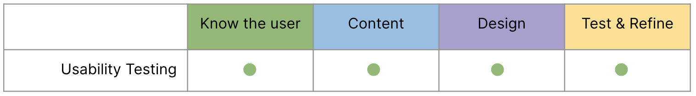

# Week 4: User Validation 

::: warning Preparation Required

To maximize your engagement and success in the course, it is crucial to thoroughly review the weekly module before each class. Your active participation depends on diligently meeting this preparation requirement, ensuring you are fully informed and ready to contribute to discussions and activities.
:::

## Learning Objectives

By the end of this week, students will:

- Gain a deeper understanding of the role of user testing and iteration in the UXD process.
- Learn and practice essential testing and iterating skills using appropriate tools.
- Get introduced to the major project for the term.

## Slides

[MAD9034 4-1 Testing](/f2024/Concept-Testing.pdf) 
<!--[MAD9034 4-2 Presentations_MajorProjectIntro](https://drive.google.com/file/d/1fycnyEF-Crw1PGqQKAYwoc0HiLXgG3GX/view?usp=sharing)-->

## Usability Testing

### Understanding the Basics

Usability testing, also known as user testing, involves evaluating a prototype, product, or service by testing it with real users. The primary goals are to:

- Identify design problems.
- Discover opportunities for improvement.
- Gain insights into user behavior.

<YouTube
  title="Usability Testing 101"
  url="https://www.youtube.com/embed/n8MnoJyl3W4?si=IvjdnQ46q26izrYj"
/>

### Why Usability Testing?

Usability testing provides valuable information about:

- A user's ability to complete tasks.
- The time it takes to complete tasks.
- User satisfaction.
- Opportunities for improvement.
- Overall performance.

**Prototyping and Usability** Testing give product teams the confidence to try new ideas, because they will be validated before too much time or money is invested.

### Key Elements

When conducting usability testing, pay attention to these key elements:

- **What to Test:** Define the specific tasks and flow that you want to evaluate. It sets the stage for a focused assessment.
  (Learn more: [Usability Testing 101](https://www.nngroup.com/articles/usability-testing-101/))

- **Prototype Fidelity:** Decide the level of detail your prototype should have. This impacts how realistically users can interact with it.
  (Learn more: [Usability Testing 101](https://www.nngroup.com/articles/usability-testing-101/))

- **Participants:** Select participants who truly represent your target audience. Their feedback will be the most valuable.
  (Further Reading: [A Cheatsheet for User Interview and Follow Ups Questions](https://stephaniewalter.design/blog/a-cheatsheet-for-user-interview-and-follow-ups-questions/))

- **Facilitator and Note Taker:** Appoint roles for guiding the usability test and capturing valuable observations.

By addressing these elements, you'll ensure a comprehensive usability testing process that yields actionable insights.

## The Usability Testing Process

### Execution

- **Participant:** They interact with the prototype one task at a time while vocalizing their thoughts.
- **Facilitator:** Observes without interference and may ask clarifying questions.
- **Note Taker:** Records both quantitative and qualitative data.

### Measuring and Analyzing Data

**Quantitative Data** includes metrics like success rate, error rate, task completion time, and user satisfaction.

**Qualitative Data** covers the participant's navigation path, encountered problems, comments, recommendations, and answers to open-ended questions.

## Reporting Findings

In usability testing, reporting is crucial. Share both positive and negative findings, and include:

- Direct user quotes when possible (create personas).
- Quantitative data, such as task completion rates and satisfaction levels.
- Problem severity levels (critical, serious, minor).
- Recommendations for addressing issues.
- Next steps in the UX process.

## Additional Resources

Watch [Usability Testing 101](https://www.nngroup.com/articles/usability-testing-101/) for an introduction. 
Explore [User Interview and Follow-Ups Questions](https://stephaniewalter.design/blog/a-cheatsheet-for-user-interview-and-follow-ups-questions/) for effective questioning. 
Dive into the [Phase 5 - Prototype](https://designsprintkit.withgoogle.com/methodology/phase5-prototype) for hands-on experience.

<YouTube
  title="Sprint: Friday"
  url="https://www.youtube.com/embed/jQmBuKN10VY?si=PSTq4BSHPpRf-J7c"
/>

### Reporting Usability Test Results

For detailed guidance on reporting usability test results, visit [Reporting Usability Test Results.](https://www.usability.gov/how-to-and-tools/methods/reporting-usability-test-results.html)
