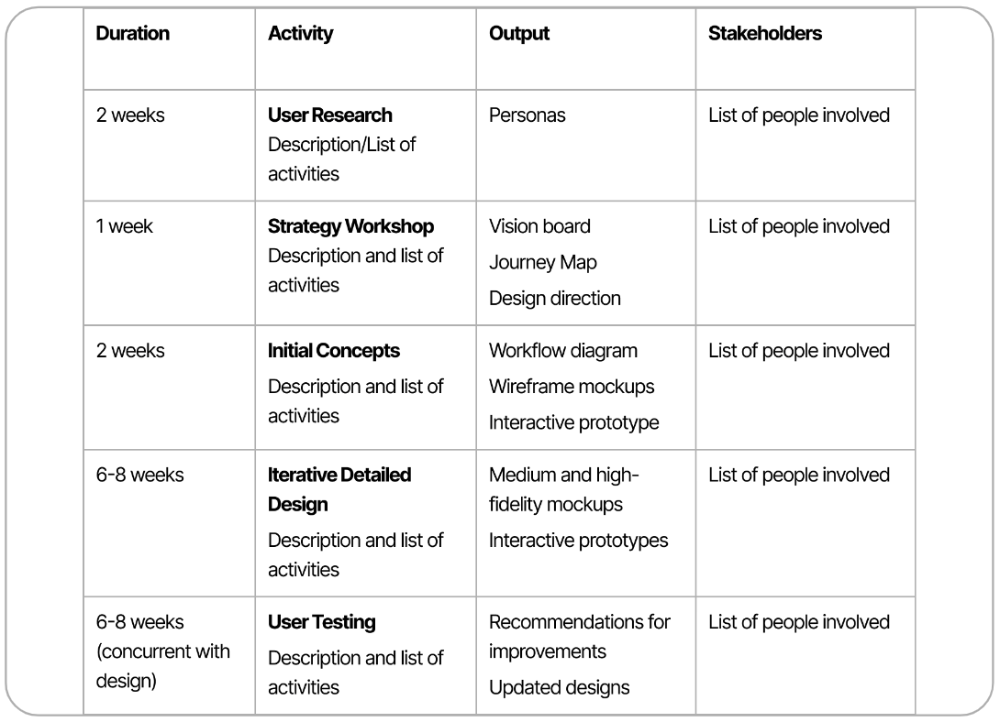
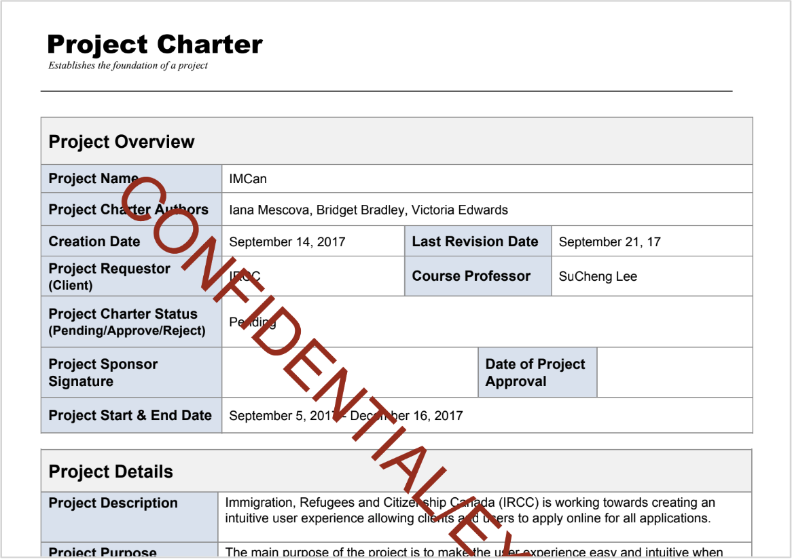

# Week 5: Product Research and User Research

::: warning Preparation Required

To maximize your engagement and success in the course, it is crucial to thoroughly review the weekly module before each class. Your active participation depends on diligently meeting this preparation requirement, ensuring you are fully informed and ready to contribute to discussions and activities.
:::

## Learning Objectives

By the end of this week, you should:

- Understand the objectives of the major project and identify suitable user-research methods.
- Be familiar with UX project planning and create a plan for your individual project.

## Slides

[MAD9034 5-1 Product Research and Persona Deep Dive](https://drive.google.com/file/d/1rth4OPA7LjoNtZsDZ5evRseR5XWjvBaB/view?usp=sharing) 

MAD9034 5-2 Persona Research <Badge type="error" text="To be released before class" />

## Product Research

### Definition and Goals

[Product research - Meaning, Importance, Stages, Example.](https://www.mbaskool.com/business-concepts/marketing-and-strategy-terms/8598-product-research.html#3)

Product research involves systematically gathering and analyzing information to understand a specific product, its market, and potential customers.

#### Goals:

- Understand the market segment.
- Analyze the competitive landscape.
- Identify strengths and weaknesses of competing products.
- Define your product's competitive advantage.
- Explore how your product can gain market share.

### Product Research vs User Research

Product Research focuses on the market and existing products, while User Research delves into user needs and behavior.

|     Product Research Studies      |      User Research Studies      |
| :-------------------------------: | :-----------------------------: |
|            The market             |            The user             |
| Products that exist in the market |           Unmet needs           |
|           Product risks           |         Product demands         |
|           Market risks            |        Product features         |
|     What people say they want     |        What people need         |
|       What people will buy        | How people will use the product |

#### Benefits

- **Informed Decision-Making:** Data-driven insights minimize risks and increase the likelihood of product success.
  A well researched product will meet the requirements of the customer in a much better way. Understanding the competition can really help make a product which solves known product issues in that market.
- **Customer-Centric Approach:** Tailoring products to customer needs enhances satisfaction and builds brand loyalty.
  It helps companies to understand what the customers really want, and what is likely to succeed in the market using available technology.
- **Competitive Edge:** Thorough research identifies gaps in the market, leading to innovative and unique solutions.
  It can help to refine new product ideas.

#### Components

- Business research
- Market research
- Competitive analysis
- Brand research

In a nutshell, market research is valuable because it shows us broad information; user research is valuable because it gives us deep insights.

- **Product research** >> **what people want**
- **User research** >> **what people need**
  - Evaluates users’ ability to complete tasks, and their satisfaction with the product

#### Example: The Power of Product and User Research

**Product Research:** In a product research study, it was discovered that travelers expressed a desire for lighter luggage. This finding seemed to suggest that reducing the weight of luggage would address their concerns.

**User Research:** However, a deeper understanding emerged through user research. Observing travelers at the airport revealed that the real issue was not just the weight of the luggage but the challenge of carrying it from point A to point B. It became evident that what people needed was luggage with wheels to ease the burden of transportation.

**Conclusion:** This example underscores the significance of both types of research in positioning a product effectively in the market and determining the core needs it should address.

Market research provides valuable broad insights, while user research delves deeper, uncovering the root issues users face. Depending on the business context, one or the other may take precedence – market research is essential for shaping business models, while user research guides feature prioritization and design decisions.

In essence, this case highlights that a balanced approach, leveraging both market and user research, is crucial for steering product development in the right direction.

For a detailed exploration of this example, you can refer to this [article](https://medium.com/@reassembleux/market-research-vs-user-research-are-they-the-same-3ec59dec637f).

### Business Research

**Business research** is a crucial element of product research and development. It involves the systematic gathering, analysis, and interpretation of data related to various aspects of a product's development, launch, and ongoing success in the market. Here's a more detailed look at business research:

<CollapsibleSection text="More information on Business Research">

#### Components of Business Research

1. **Business and Pricing Models**: Understanding your business model is essential. Are you a subscription-based service, an e-commerce platform, or a software provider? Analyze how your chosen model aligns with your product and its target market.

2. **Business Regulations**: Depending on your industry and location, various regulations may apply to your product. It's essential to research and comply with these regulations to avoid legal issues.

3. **Economic Conditions and Other Factors**: The economic landscape can significantly impact your product's success. Investigate the broader economic ecosystem, including factors like inflation, interest rates, and consumer spending, that may affect your product's performance.

#### How to Conduct Business Research

- **Gather Cost Information**: Calculate the costs associated with product development, marketing, and ongoing maintenance. This data helps in pricing strategies and profit projections.

- **Investigate the Larger Economic Ecosystem**: Analyze how external economic factors may influence your product's viability. For example, a recession might affect consumer spending on non-essential products.

</CollapsibleSection>

### Market Research

**Market research** is a fundamental aspect of product research. It involves collecting and analyzing data about a target market to inform the development, design, and marketing of a new product. Here's a more comprehensive look at market research:

<CollapsibleSection text="More information on Market Research">

#### Components of Market Research

1. **Market Size and Characteristics**: Determine the size of your target market and its defining characteristics. This includes demographics, geographic locations, and psychographic data.

2. **Market Expectations**: Understand what consumers in your target market expect from products like yours. Identify their needs, preferences, and pain points.

3. **Demands and Opportunities**: Research the specific demands within your market niche and identify opportunities for innovation or differentiation.

4. **Risk Mitigation**: Assess potential risks in entering the market, such as competition, changing consumer preferences, or economic instability.

#### How to Conduct Market Research

- **Surveys or Interviews**: Collect data directly from potential customers through surveys or interviews. Ask questions about their needs, preferences, and willingness to adopt new products.

- **Focus Groups**: Organize focus groups to gather insights from a small, diverse group of participants. This method is useful for in-depth discussions and idea generation.

- **Secondary Research**: Explore existing data sources, including company records, research studies, books, and industry reports. Secondary research can provide valuable insights without the need for primary data collection.

</CollapsibleSection>

### Competitive Analysis

**Competitive analysis** is a vital component of product research that involves evaluating and comparing your product or service against similar offerings from other companies in the market. Here's a more detailed overview of competitive analysis:

<CollapsibleSection text="More information on Competitive Analysis">

#### Components of Competitive Analysis

1. **Identify Competitors**: Create a list of direct and indirect competitors in your market. Direct competitors offer products or services similar to yours, while indirect competitors may address similar needs through different means.

2. **Gather Information**: Collect data about your competitors, including their product features, pricing strategies, market positioning, and user experience.

3. **Pricing and Monetization**: Analyze how your competitors price their products and how they monetize their offerings. This information can help you determine your own pricing strategy.

4. **Market Positioning**: Examine how your competitors position themselves in the market. Identify their unique selling points (USPs) and areas where they excel or fall short.

5. **User Experience**: Evaluate the user experience of your competitors' products. This includes assessing usability, design, and overall customer satisfaction.

#### How to Conduct Competitive Analysis

- **Customer Reviews and Feedback**: Review customer feedback and reviews on platforms like social media, review websites, and app stores. Pay attention to common complaints and praises.

- **Marketing and Branding**: Analyze your competitors' marketing strategies, messaging, and branding efforts. Understand how they communicate their product's value to customers.

- **SWOT Analysis**: Perform a SWOT (Strengths, Weaknesses, Opportunities, Threats) analysis for each competitor. Identify areas where you can capitalize on their weaknesses or leverage their strengths.

- **Competitor's Roadmap**: Research your competitors' product development roadmap to anticipate their future releases and innovations.

- **Differentiation**: Determine how your product can differentiate itself from competitors. Identify unique features or value propositions that set your product apart.

</CollapsibleSection>

## User Research

The user persona offers a deeper level of detail, focusing on a subset of individuals within the target market who have shared objectives and requirements. Through a user persona, intricate aspects come to life, enabling all stakeholders of the product to connect with this individual on an instinctual level. These personas encompass the human elements of names, occupations, distinct traits, abilities, aspirations, and challenges. Constructing a user persona fosters empathy for this individual, a crucial factor in shaping product choices.

> "Personas help everyone from programmers to executives understand users in a way no other tool can: at a gut level. Personas help guide design decisions, end those lengthy arguments about what users need, and get everyone to agree on what product you're building."​ (Alan Cooper, American software designer and programmer, coined the term “persona” for the first time)

### Why we need them

Thousands of people located in multiple geographical locations, with various cultural expectations and product demands, with different roles and responsibilities, time investment and levels of expertise and sophistication distilled down to a few user personas.

### A Product Team Tool

1. **Condense Diverse User Profiles**: In any given target market, you'll encounter a diverse range of individuals with varying needs, preferences, and behaviors. User personas help condense this diversity into a few representative profiles, making it easier to design for your entire audience.

2. **Remove Biases**: Designing for your "average" user can introduce biases and overlook the needs of specific user segments. User personas help in eliminating these biases by considering the unique characteristics of different users.

3. **Maintain Focus**: With well-defined user personas, your team can maintain a clear focus on who the product is intended for. This prevents feature creep and ensures that product decisions align with the needs of your primary users.

### Primary and Secondary Personas

- **Primary Persona**: The primary persona represents the core users of your product. These are the individuals who will benefit the most from your solution.

- **Secondary Persona**: Secondary personas represent users whose needs must be accommodated without compromising the primary user's experience. These users may have different requirements, but their interaction with the product should not detract from the primary persona's satisfaction.

### Steps to Create User Personas:

1. **Identify Your Users**: Begin by identifying the individuals who make up your target audience. This includes gathering demographic, geographic, psychological, and behavioral data. You can source this information from various channels.

2. **What and How to Ask**: Conduct interviews, focus groups, and surveys to collect insights from potential users. Ensure that your questions are open-ended to encourage participants to share their thoughts and experiences freely. [Sample interview Script](https://www.smashingmagazine.com/2014/08/a-closer-look-at-personas-part-2/#1-identify-your-users)

3. **Get Access to Users**: Establish contact with potential users. If you have an existing user base, leverage it to gather data. If you're a new company or launching a new product, consider researching competitors' users to gain valuable insights.

4. **Gain an Understanding of the Users**: Dive deep into the experiences of your potential users. Understand their pain points, motivations, goals, and challenges related to the problem your product aims to solve.

5. **Analyze the Data**: Examine the data collected from interviews, focus groups, and surveys. Identify patterns, commonalities, and significant differences among users.

6. **Synthesize a Model of Users**: Create user personas by aggregating the information into detailed profiles. Each persona should include demographic information, goals, frustrations, behaviors, and any other relevant details.

7. **Produce a Persona Document**: Document the key details of each persona in a structured document. Include their name, age, job title, goals, pain points, and a brief narrative that humanizes the persona.

8. **Socialize the Personas**: Share the personas with your project team and stakeholders. Ensure that everyone involved in the product development process understands and empathizes with the personas. Personas should become a reference point for decision-making throughout the project.

User personas are powerful tools that keep the user at the center of the design process. By following these steps, you can create personas that inform and guide your product's development, ensuring that it meets the diverse needs of your target audience.

## Project Planning

UX Project Plan: Lists UX activities with descriptions, durations, deliverables, and team members.

**Overall Project Plan:** Includes activities across all disciplines, summarizing UX activities.

### UX Project Plan

- Lists UX activities with descriptions, durations, deliverables, and team members.

Simple Project Plan

**A UX Project Plan is a living document!**

### Project Planning Documents

<CollapsibleSection text="Project Charter">

#### Project Charter

**Project Charter Components**

- Scope, objectives, and purpose
- Individuals/roles involved
- Deliverables expected and budget
- Assumptions and risks

**Project Charter Goals**

- **Shared understanding** of the goals of the project
- **Contract** between key stakeholders and the team

</CollapsibleSection>

<CollapsibleSection text="Project Scope">

#### Project Scope

**Project Scope Components**

- Deliverables, constraints, assumptions and key success metrics
- Boundaries

**Project Scope Goals**

- Define the boundaries of a project before the project begins
- Act as a **contract** between key stakeholders and the team

</CollapsibleSection>

<CollapsibleSection text="Design Brief">

#### Design Brief

**Design Brief Components**

- Objectives and problems to solve
- What’s in scope, what isn’t
- Target market
- Timelines
- Required vs available resources
- Risks
- Team routines and roles
- Tools, etc

**Design Brief Goals**

- To ensure a shared understanding of the goals and scope of the design (or redesign)

</CollapsibleSection>

<CollapsibleSection text="Risk Assessment">

#### Risk Assessment

**Risk Assessment Components**

- Risk Event
- Risk Level
- Impact on Project
- Precautions
- Actions in Case of Event
- Responsibility

**Risk Assessment Goals**

- To **anticipate** and **prepare** for risks your project is likely to encounter

</CollapsibleSection>

### Project Management Tools (Recommended in 2023)

Explore [Top Management Software of 2023.](https://www.top10.com/project-management/comparison?utm_source=google&kw=top%20project%20management%20tools&c=641267620270&t=search&p=&m=p&adpos=&dev=c&devmod=&mobval=0&network=g&campaignid=15692302968&groupid=134576865347&targetid=kwd-4221054342&interest=&physical=9000679&feedid=&a=200435&ts=&topic=&clicktype=&camtype=&gclid=CjwKCAjwrranBhAEEiwAzbhNtfgFXJBLlglYdWFWB1lXTB9Rqw-eKVqN0k6aVyeYTJ32kgMen0IqgxoCSF0QAvD_BwE)
