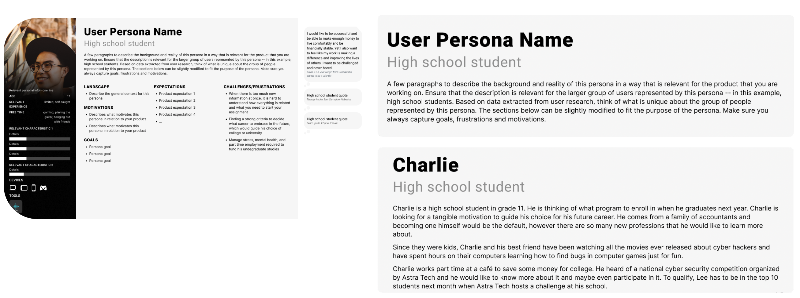
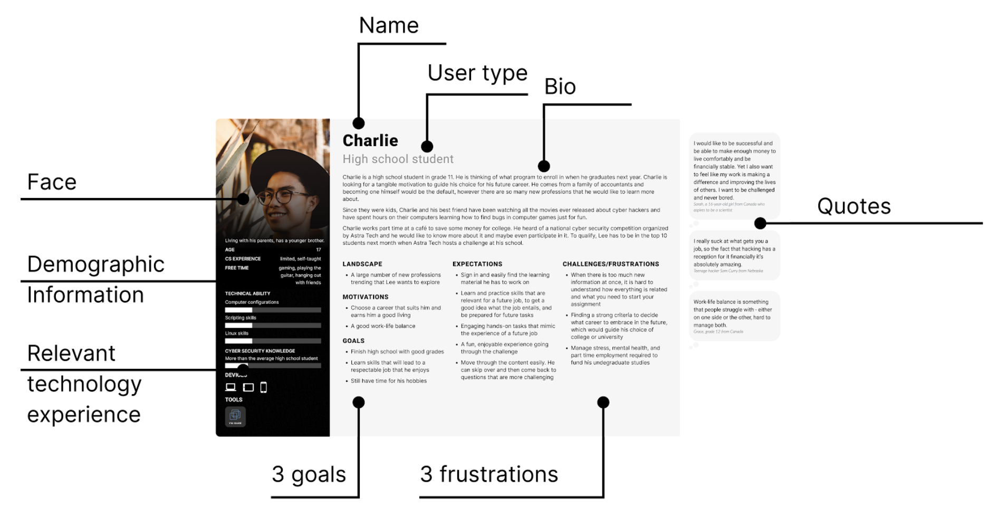

# Week 6: Persona Creation: Analyzing and making sense of research data

::: warning Preparation Required

To maximize your engagement and success in the course, it is crucial to thoroughly review the weekly module before each class. Your active participation depends on diligently meeting this preparation requirement, ensuring you are fully informed and ready to contribute to discussions and activities.
:::

## Learning Objectives

By the end of this week, you will:

- Review and analyze user persona spreadsheet data that you have already submitted.
- Gain hands-on experience in utilizing user research data to create personas and proceed to develop usage scenarios.

<!--## Slides

[MAD9034 6-1 How to Create Personas](https://drive.google.com/file/d/1hGO_149FtIu6YldHVhzMhQviyq42YTOx/view?usp=sharing)

[MAD9034 6-2 Persona Working Session](https://drive.google.com/file/d/1JjUezwe6SboRodR8C_pCDY2V10T6lN9S/view?usp=sharing)-->

### What personas are and what they are not

**Personas are**

- Derived from real user behaviors, expectations, and context of use.
- Represent the means to achieve goals.
- Composed of unarticulated information observed during interviews and observations.
- The foundation for user-centered product design.

**Personas are not**

- Dictated by what the organization thinks users should have in the product.
- Driven solely by the preferences of early adopters, as they represent a niche group.
- A reflection of what programmers want.
- Shaped by customer requests (this is product marketing research, not user research).
- A reflection of socially accepted preferences and attitudes.

### Making sense of research data

> "Personas help everyone from programmers to executives understand users in a way no other tool can: at a gut level. Personas help guide design decisions, end those lengthy arguments about what users need, and get everyone to agree on what product you're building." – Alan Cooper

- A UX persona is a synthesized representation of users, drawn from observations of various individuals.
- Each persona mirrors a significant portion of real-world users, facilitating the designer's focus on a manageable and memorable cast of characters.
- Personas enable designers to create tailored designs for different user types, emphasizing a specific individual rather than a generic user.

### Analyzing the data

1. **Examine a Variety of Variables Across Participants:**

   - Identify relevant variables or attributes based on interview data.
   - Assess each participant against these attributes.
   - Identify common traits among participants with similar attributes.
   - Group participants with shared attributes and common traits into personas.

2. **Identify Unique Attributes:**

   - Recognize attributes that are not shared among participants.
   - Account for these differences in your design.

   Example: Participant A may seek both regular ongoing support and ad-hoc support, but this may not necessitate a separate persona.

3. **Determine Which Personas to Design For:**

   - When dealing with multiple personas, specify which personas are in scope and which are not.
   - If multiple personas are relevant, designate primary and secondary personas.

### Synthesizing a model of users

Once you've identified user groups, consider how to best describe them.

- Attributes derived from research aided in grouping users into personas. However, the traits captured in the persona document may differ.
- Decide what information to include in the persona document.

  Example: Bio for a high school student persona interested in learning about cybersecurity.

### Anatomy of a Persona document

A persona document is a crucial tool that provides a comprehensive and easily digestible overview of your user personas. It serves as a reference point for the entire product team and helps ensure that user-centric decisions guide the design and development process effectively. To make the most of this tool, it's important to understand its key components:

1. **Persona Name and Image**:

   - Each persona is typically given a name that reflects their characteristics and traits. This makes them more relatable and memorable.
   - An associated image or illustration can help visualize the persona. While it may not represent an actual user, it adds a human element to the persona, reinforcing empathy.

2. **Demographics**:

   - Include details such as age, gender, location, and any other relevant demographic information.
   - Demographics provide a quick snapshot of who the persona represents and are especially helpful in marketing and design decisions.

3. **Background**:

   - Provide a brief background story for the persona. This could include their job, education, family status, and other context that helps team members understand their daily life.

4. **Goals and Needs**:

   - Outline the primary goals and needs of the persona. What are they trying to achieve when using your product or service?
   - Understanding their goals helps in tailoring the user experience to meet these specific objectives.

5. **Pain Points and Challenges**:

   - Highlight the common pain points, challenges, or frustrations the persona encounters when using similar products or services.
   - This section identifies areas where your product can provide solutions or improvements.

6. **Behaviors and Preferences**:

   - Describe the typical behaviors and preferences of the persona. How do they interact with technology? What are their communication preferences?
   - These insights guide decisions related to user interface design and communication channels.

7. **Key Quotes**:

   - Include actual quotes or statements from user interviews that capture the persona's perspective.
   - These quotes serve as powerful reminders of real user needs and motivations.

8. **Tech Proficiency**:

   - Assess the persona's level of technical proficiency. Are they tech-savvy, or do they prefer simplicity and ease of use?
   - This knowledge informs decisions about product complexity and user guidance.

9. **Usage Scenarios**:

   - Describe scenarios in which the persona would use your product or service. What specific tasks or activities are they trying to accomplish?
   - Usage scenarios help in aligning product features with user needs.

10. **Primary Goals Alignment**:

    - Connect the persona's primary goals and needs with the main objectives of your product or project.
    - This alignment reinforces the importance of addressing user needs in the project's mission.

11. **Additional Notes**:
    - Provide any additional information or context that might be relevant to understanding the persona.
    - These notes can include unique characteristics, exceptional behaviors, or other details that don't fit neatly into other sections.

Remember that the persona document should be concise and visually engaging. The goal is to make it a practical reference that team members can easily consult during the design and decision-making process. Including relevant images, icons, or infographics can enhance its readability and impact.

By creating a persona document that effectively communicates the key attributes and motivations of your user personas, you empower your team to make user-centered design decisions with confidence.

### Socializing your product Personas

After creating persona documents, it's crucial to socialize them for effective use.

**You can achieve this through:**

- Organizing persona presentations and inviting relevant stakeholders.
- Displaying persona documents as posters in common areas or on a dedicated product page for remote teams.
- Incorporating personas into user stories and planning meetings.
- Finding creative ways to promote their value and encourage their utilization among team members.
