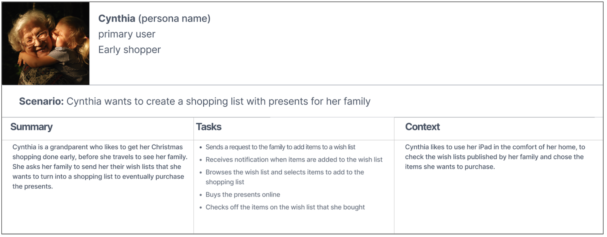
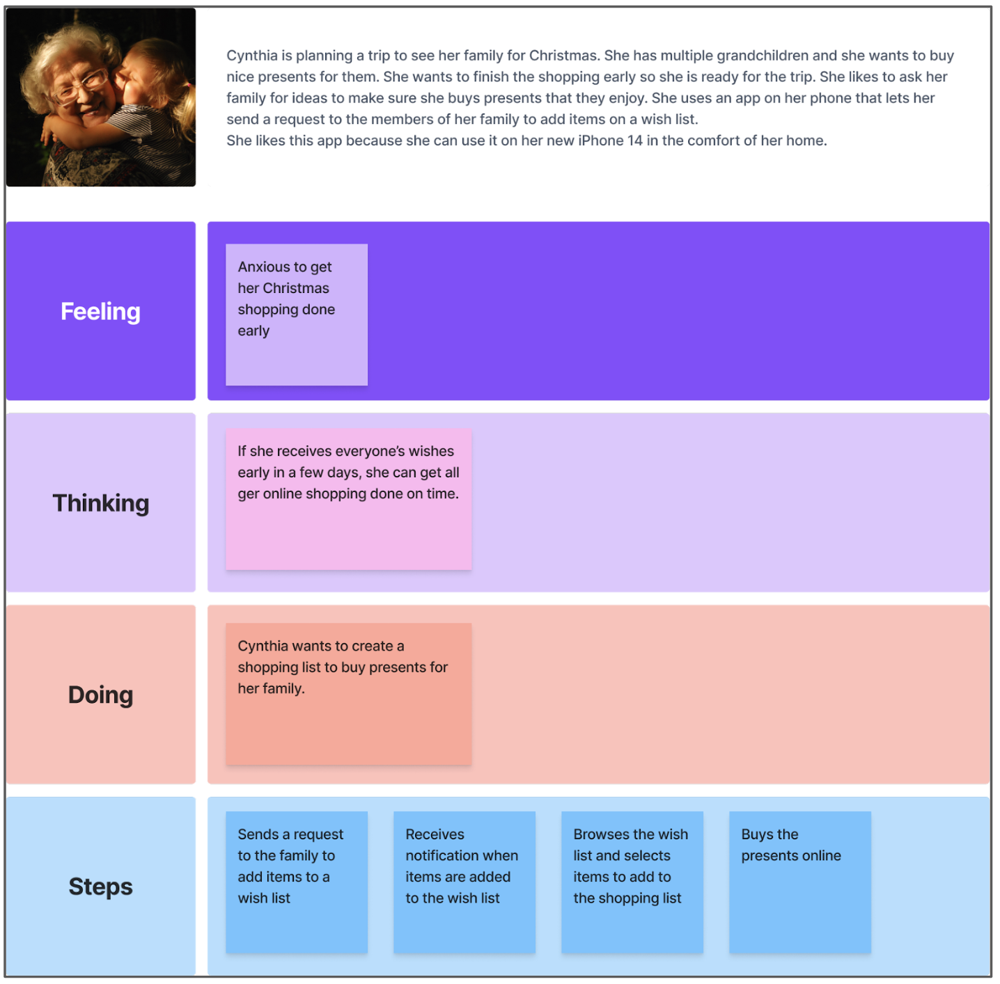
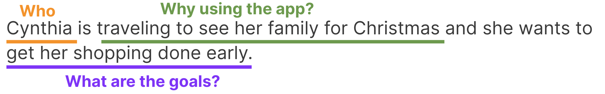
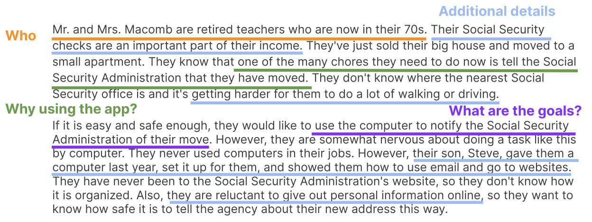

# Week 7: User scenarios and information architecture

::: warning Required Preparation

Please ensure that you prepare for each week's lessons by thoroughly reviewing the weeks module prior to the start of class. This preparation is essential to ensure you are fully informed and ready to actively engage in the upcoming topics and discussions. Your active participation and success in the course depend on meeting this requirement diligently.

:::

## Learning Objectives

- Have a solid understanding of the why, when, what, and how to create scenarios
- Translate user research data to create a usage scenario
- Harness your knowledge of information architecture (IA) to create high-level navigation for your product
- Learn other IA technique for user flow mapping

## Slides

<!-- [MAD9034 3-1 Ideation](https://drive.google.com/file/d/1qTl_j58dtlZw8Fl3GbITSczUfGFaVnw6/view?usp=sharing) 
[MAD9034 3-2 Prototyping](https://drive.google.com/file/d/1z21881c99OuAJHjRGDP0xtdgJptW9kt2/view?usp=sharing) -->

## Scenarios

### Definition and Goals

Scenarios are short stories that provide context behind why a specific user group represented by a persona use your product and how this persona is planning to carry on a key task.

**Summary**

- Scenarios can be developed once you have your personas.
- They are a form of storytelling meant to bring life to an abstract use case scenario.
- They describe how a group of users represented by a persona, intend to carry on a key task in your product.
- A scenario provides context for the usage of the product without going into a great level of detail.

**Goals**

- Document the goals and questions to be achieved by users (persona)
- Define the different ways taks can be accomplished with the product
- Give life to an abstract use case scenario

### Personas and Usage Scenarios

[Scenario Mapping: Design Ideation Using Personas](https://www.nngroup.com/articles/scenario-mapping-personas/)

**A usage scenario describes:**

the persona’s current situation
a hypothetical, improved one that the persona will have with the new product

|                        |                                                                                           |
| :--------------------: | :---------------------------------------------------------------------------------------: |
|        PERSONA         |                                         SCENARIO                                          |
| Who (uses the product) | - Why and How (the persona is using the product)  - Existing or hypothetical situation |

### Scenario Examples

### Measure and Analysis

|                                                                                                                                                                                                                            |                                                                                                                                                                                                                                                        |                                                                                                                                                                                                  |
| -------------------------------------------------------------------------------------------------------------------------------------------------------------------------------------------------------------------------- | ------------------------------------------------------------------------------------------------------------------------------------------------------------------------------------------------------------------------------------------------------ | ------------------------------------------------------------------------------------------------------------------------------------------------------------------------------------------------ |
| Scenarios                                                                                                                                                                                                                  | Use Cases                                                                                                                                                                                                                                              | User Stories                                                                                                                                                                                     |
| **User’s perspective:** how the user uses or envisage using a system to accomplish a task                                                                                                                                  | **System’s perspective:** how the system responds to a request                                                                                                                                                                                         | Written sequences of actions and events that lead to an outcome.                                                                                                                                 |
| - tied to personas   - part of a story about a particular user type and their needs   - written in narrative form   - at the beginning of a project   - human-centered anchors to guide design and development | - part of detailed product requirement documentation   - goal of an action > trigger event that starts a process >each step required   - written in the form of an actor or user, performing an action, followed by the expected system response | - used in Agile development   - defined during development, before or at the beginning of each sprint   - short sentences that capture the essence of a user need  - One task per story |
| **Example:** Cynthia wants to create a shopping list from her family’s wish list.                                                                                                                                          | **Example:** Cynthia navigates to the wish lists > selects the items she wants to buy and > adds them to the shopping list.                                                                                                                            | **Example:** As Cynthia, the grandparent, I want to have a straightforward way to add the items from the wish list to the shopping list, so that I can purchase the gifts for my family.         |

### Why might we use scenarios?

To answer these questions:

1. **Who** is the user?
2. **Why** does this user use my product?
3. **What** does this user want from my product?
4. **How** can this user achieve their goals?
5. **Why** does this persona want to use my **product and not a different one?**

### Types of Scenarios

1. **Goal-Based/Task-Based**
   Focus only on what the user wants to do defining information architecture and content usability testing scenarios

   

2. **Elaborated**
   Better understand the persona to design for better understand how the persona characteristics may affect the interaction with the product/service helps craft the right content and functionality for a specific user type

   

3. **Full Scale Task**
   Includes the steps required to complete a task from a user’s perspective how the product would support the task-oriented or elaborated scenario that you started with

Cynthia is traveling to see her family for Christmas and she wants to get her shopping done early.

- Opens the wish list app
- Sends a request to her family for wish lists
- Receives notifications when a family member added items to the wish list
- Adds items from the wish list to the shopping list
- Purchases the items online
- Checks the wish list which has all the purchased items checked off

### Best Practices

**Source:** User research 
**Format:** Narrative 
**Actor:** Persona 
**Goal:** The goal/task that the persona wants to accomplish 
**Summary:** Summarize the scenario, motivations, persona goals, etc. Steps Each step required to complete goal 
**Context of Use:** The actual conditions the app is used (in a normal day-to-day working situation, at home, etc) 

### Usage

1. **Design Ideation:**

- Focus on your user’s tasks
- Eliminate bias
- Organize the content and entry points into the key tasks in a manner that makes sense to your users

2. **Usability testing:**

- Orient user research around your users’ tasks > evaluate how effectively your product supports these tasks.
- Identify the key steps required to complete the task > observe the path followed by users > evaluate the effectiveness of your product’s architecture and navigation.

### Dos and Don’ts

**DON’T** Marty clicks on the username input field then types his name. He then clicks on the password input field and enters his password. Marty clicks on the login button.

**DO** Marty signs into the product.

## Information Architecture

<Badge type="error" text="Coming Soon" />
