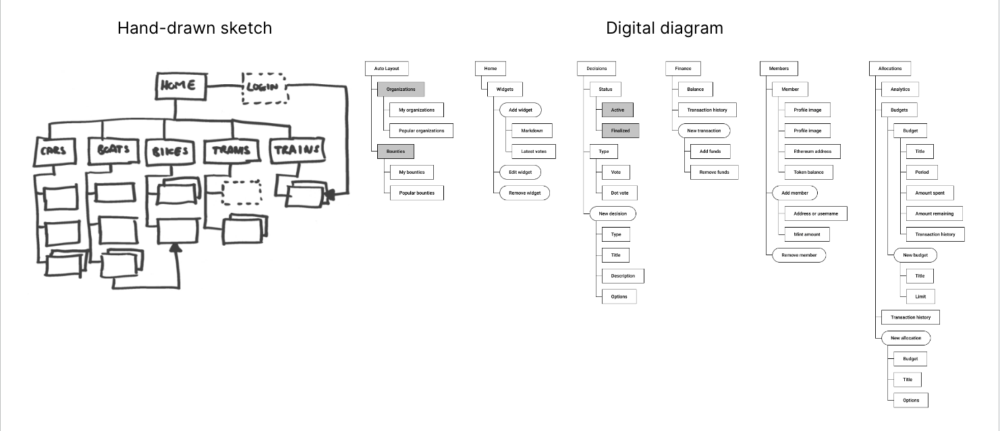
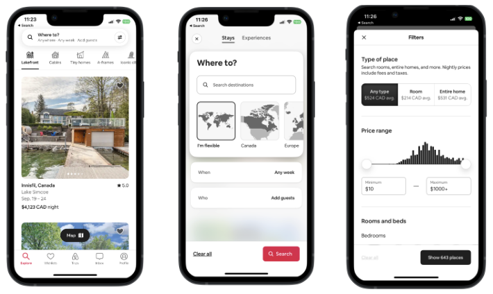
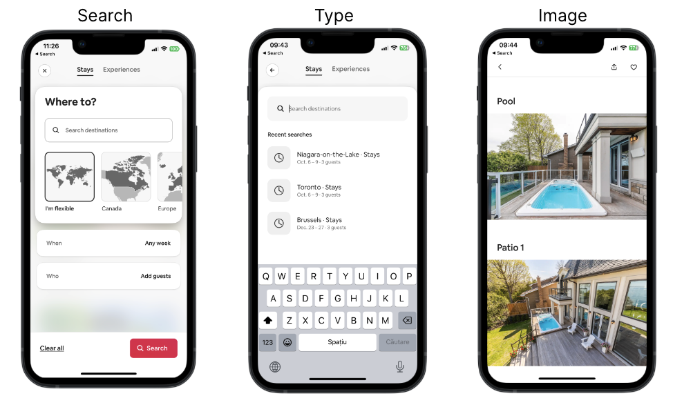
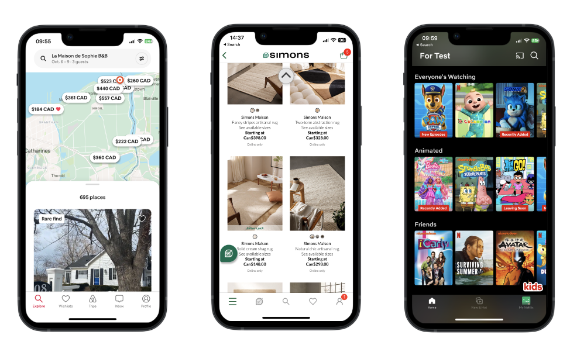
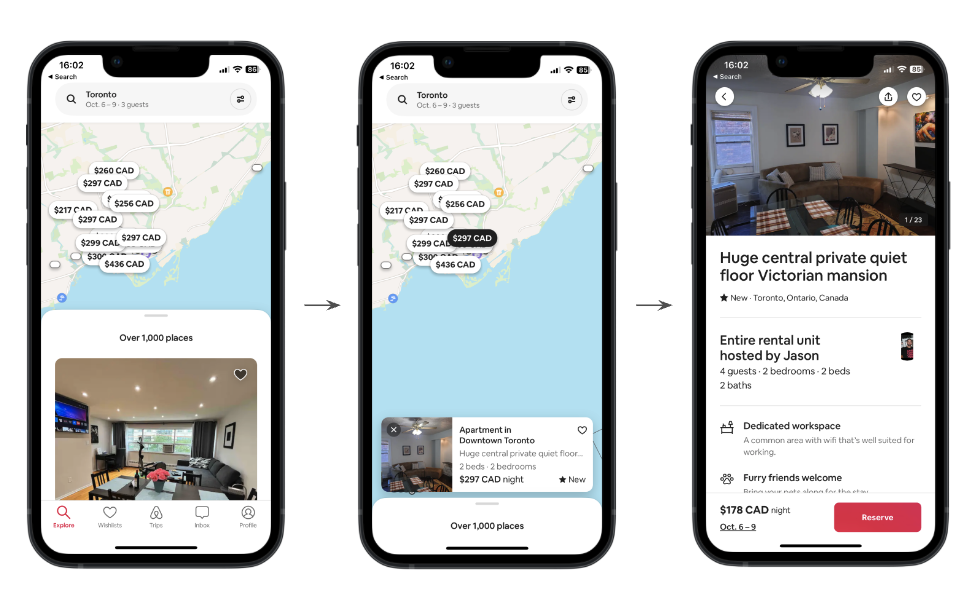
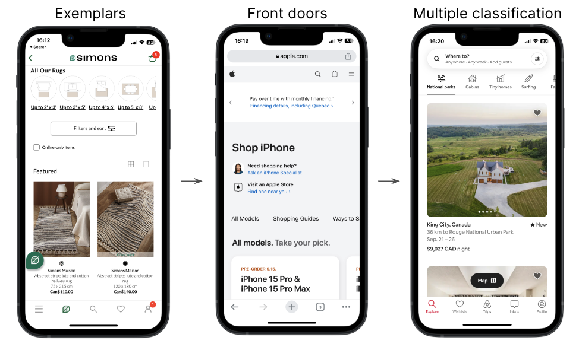
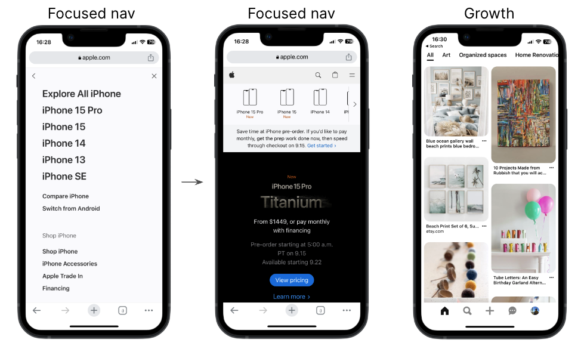

# Usage Scenarios and Information Architecture

::: warning Required Preparation

Please ensure that you prepare for each week's lessons by thoroughly reviewing the weeks module prior to the start of class. This preparation is essential to ensure you are fully informed and ready to actively engage in the upcoming topics and discussions. Your active participation and success in the course depend on meeting this requirement diligently.

:::

## Learning Objectives

- Understand why, when, what, and how to create user scenarios.
- Translate user research data into meaningful usage scenarios.
- Apply knowledge of information architecture (IA) to design high-level navigation for your product.
- Learn about IA techniques for mapping user flows.

<!--## Slides

[MAD9034 7-1 Usage Scenarios](https://drive.google.com/file/d/1GZP6lEuhGf1Fts4z97v5sCxyqpL2NMz-/view?usp=sharing) 
[MAD9034 7-2 Information Architecture](https://drive.google.com/file/d/1TQ8IcI8FGtHrjlP3b8GLu-QZoQ6f73pW/view?usp=sharing)-->

## Class 1: Usage Scenarios

### Definition and Goals

Scenarios are short stories that provide context for why a specific user group, represented by a persona, uses your product and how this persona plans to complete a key task.

**Summary**

- Develop scenarios after creating personas.
- They are narratives that breathe life into abstract use cases.
- Scenarios explain how user groups, represented by personas, intend to complete key tasks in your product.
- They provide context for product usage without excessive detail.

**Goals**

- Document user (persona) goals and questions.
- Define various ways tasks can be accomplished with the product.
- Add life to abstract use case scenarios.

[Scenario Mapping: Design Ideation Using Personas](https://www.nngroup.com/articles/scenario-mapping-personas/)

**A usage scenario describes:**

- The persona's current situation.
- A hypothetical improved situation with the new product.

|                        |                                                                                         |
| :--------------------: | :-------------------------------------------------------------------------------------: |
|        PERSONA         |                                        SCENARIO                                         |
| Who (uses the product) | - Why and how (the persona uses the product).  - Existing or hypothetical situation. |

### Scenario Examples

### Measure and Analysis

| User Stories                                                                                                                                                                                    | Scenarios                                                                                                                                                                                                                   | Use Cases                                                                                                                                                                                                                                               |
| ----------------------------------------------------------------------------------------------------------------------------------------------------------------------------------------------- | --------------------------------------------------------------------------------------------------------------------------------------------------------------------------------------------------------------------------- | ------------------------------------------------------------------------------------------------------------------------------------------------------------------------------------------------------------------------------------------------------- |
| **User's perspective:** How the user uses or envisions using a system to accomplish a task.                                                                                                     | **System's perspective:** How the system responds to a request.                                                                                                                                                             | Written sequences of actions and events leading to an outcome.                                                                                                                                                                                          |
| - Used in Agile development.  - Defined during development, before or at the beginning of each sprint.  - Short sentences capturing the essence of a user need.  - One task per story. | - Tied to personas.  - Part of a story about a particular user type and their needs.  - Written in narrative form.  - At the beginning of a project.  - Human-centered anchors to guide design and development. | - Part of detailed product requirement documentation.  - Goal of an action > trigger event that starts a process > each step required.  - Written in the form of an actor or user performing an action, followed by the expected system response. |
| **Example:** As Cynthia, the grandparent, I want to have a straightforward way to add the items from the wish list to the shopping list, so I can purchase the gifts for my family.             | **Example:** Cynthia wants to create a shopping list from her family’s wish list.                                                                                                                                           | **Example:** Cynthia navigates to the wish lists, selects the items she wants to buy, and adds them to the shopping list.                                                                                                                               |

| User Story                                                                                                                                                                  | Scenario                                       |
| --------------------------------------------------------------------------------------------------------------------------------------------------------------------------- | ---------------------------------------------- |
| As Cynthia, the grandparent, I want to have a straightforward way to add the items from the wish list to the shopping list, so that I can purchase the gifts for my family. |  |

### Why Use Scenarios?

Scenarios answer critical questions:

1. **Who** is the user?
2. **Why** does this user use my product?
3. **What** does this user want from my product?
4. **How** can this user achieve their goals?
5. **Why** does this persona want to use my **product and not a different one?**

### Types of Scenarios

1. **Goal-Based/Task-Based**:
   Focuses on what the user wants to accomplish, defining information architecture and content usability testing scenarios.

   

2. **Elaborated**:
   A deeper understanding of the persona's characteristics and their effect on product interaction. Helps design content and functionality for specific user types.

   

3. **Full-Scale Task**:
   Includes all steps required to complete a task from a user's perspective. Expands on the task-oriented or elaborated scenario.

For example, Cynthia is traveling for Christmas and wants to complete her shopping early. Her scenario includes opening the wish list app, sending requests, receiving notifications, adding items to the shopping list, making online purchases, and checking off items.

### Best Practices

**Source:** User research 
**Format:** Narrative 
**Actor:** Persona 
**Goal:** The goal/task that the persona wants to accomplish 
**Summary:** Summarize the scenario, motivations, persona goals, etc. 
**Steps:** Each step required to complete the goal 
**Context of Use:** The actual conditions the app is used (normal day-to-day working situation, at home, etc).

### Usage

1. **Design Ideation**:

- Focus on user's tasks.
- Eliminate bias.
- Organize content and entry points into key tasks for user convenience.

2. **Usability Testing**:

- Align user research with user tasks for evaluating product support.
- Identify key steps required for tasks.
- Observe user paths.
- Evaluate product architecture and navigation effectiveness.

### Dos and Don'ts

**DON'T:** Marty clicks on the username input field, types his name, clicks on the password input field, enters his password, and clicks the login button.

**DO:** Marty signs into the product.

### Best Practices

- Scenarios are **based on user research**.
- At least **1 scenario per persona**.
- **Context of use** is described.
- ln each scenario, **a goal** is indicated and **a specific situation** is described.
- The **goal connects** the scenario to **a specific persona**.
- The **tasks and activities** describe **how the goal is achieved**.
- Describe the **entire sequence of steps**, in order, **from start to finish**, with an appropriate amount of detail.
- Scenarios describe **interactions, not interfaces**.
- The set of scenarios combine to describe **the core usage of the app**.

## Class 2: Information Architecture

### Definition and Goals

The art and science of organizing and labeling web sites, intranets, online communities and software to support usability and findability.

- Information architecture is the framework for your app.
- Think about IA independently of screen design.
- Evaluate the importance of content.
- Structure your screens and information to display what’s most important.
- Decide what content and information to disclose later.

[Watch Video: Information Architecture: 3 Key Models](https://www.youtube.com/embed/v39z0JPeIc8?si=Qd_qKw-Z9gH3O4tm)

**Goals**

- **Findability** relates to things users know exist somewhere in the product and they have to find them. It is like looking for your keys before you leave the house. When you test findability, you ask the user where they would go to check out the activities that they signed up for as an example. You don’t use the exact labels used in the product, you want to ask about the outcome and let them find how to get there.

- **Discoverability** is about finding something that the user doesn’t know is there, but that enhances their experience and they can highly benefit from it. This can be a new feature, or an old one presented in a different way that suddenly people can see and use.
  - Testing discoverability is not as easy because you cannot prompt users to do it. You have to observe them use the product and see if they find something they didn’t know about. Analytics can also bring some insight into this.

Keep both findability and discoverability in mind when you design your information architecture.

I highly recommend you check out the [link](https://www.nngroup.com/articles/ia-vs-navigation/) to the Norman Nielsen Group. It has very good videos and articles about information architecture. A good example is a [site map](https://www.nngroup.com/articles/ia-study-guide/).

The **information architecture (IA)** is not visible to users, it informs the UX and UI of a product.

### How they come together

|                          |                                                                                   |                                                                     |
| :----------------------: | :-------------------------------------------------------------------------------: | :-----------------------------------------------------------------: |
|         PERSONA          |                                     SCENARIO                                      |                                 IA                                  |
| **Who** uses the product | A **persona** using a **product** to achieve a **goal** in a specific **context** | Organization structure, Navigation system, Labelling, Search system |

**Information architecture helps define:**

- Organization structure
- Creating a site map: how to organize the information of the site, or the page, hierarchy of information
- Labelling system: Terminology used
- Navigation system: How to structure the content: side nav, top nv, tabs, a combination
- Search system: How users look for information

[Example of a project on Behance:](https://www.behance.net/gallery/50216285/Expense-Note-App)

### Benefits

The way the information is structured and presented in your product can turn into a competitive advantage. It can lead to:

- Shorter search times > faster way to find information > increased customer satisfaction > which becomes a competitive advantage
- Finding things fast can create a pleasant UX and create more promoters of your product.
- With everything you do as a UX designer, you want to create products that are sticky, that customers keep using and have no way to look for an alternative solution. The way you structure the IA can certainly contribute to this outcome.

Here is a [beginners guide to Information Architectures](https://uxbooth.com/articles/complete-beginners-guide-to-information-architecture/).

### Examples

- **Creating IA:** Information architecture (IA) can be represented on paper, whiteboards, with sticky notes on a wall, or using digital tools.

- **Don't Skip This Step:** Similar to how an architect plans a campus layout before designing buildings, UX designers create IA diagrams. These diagrams show the structure of the site or app, screen connections, and information depth.

- **Immediate vs. Buried Functionality:** IA helps decide what content should be easily accessible at the top level and what can be deeper in the app's structure. For example, a network for elderly users may prioritize quick access to activity lists.

- **IA in UX:** Information Architecture is a crucial UX deliverable.

- **Solution vs. Information Architecture:** Solution Architecture is the responsibility of a software architect and should collaborate effectively with Information Architecture.

### Mobile Applications

**In the context of mobile application design**, IA is the practice of labeling and giving structure to digital content.

- Content and functionality
- Access and flow: search, filters

[Information Architecture Principles Infographic](https://www.toptal.com/designers/mobile-ui/information-architecture-principles-infographic)

 

<!-- <CollapsibleSection text="Principles for Mobile: objects">

#### Principles for Mobile: objects

Different content types have their own properties, behaviours and interactions

- Search
- Type
- Image

</CollapsibleSection>

<CollapsibleSection text="Principles for Mobile: choices">

#### Principles for Mobile: choices

- Screens that give users choices and help them advance towards their goal.

</CollapsibleSection>

<CollapsibleSection text="Principles for Mobile: progressive disclosure">

#### Principles for Mobile: progressive disclosure

- People cannot consume large amounts of data at once.
- Disclose content in layers, revealing information gradually.

</CollapsibleSection>

<CollapsibleSection text="Principles for Mobile: exemplars, front doors, multiple classification">

#### Principles for Mobile: exemplars, front doors, multiple classification

- **Exemplars:** Provide examples through images, icons, lists, to illustrate the content in different categories.
- **Front doors:** For mobile sites, not native apps, expect users to come to your site in other ways than through the home page.
- **Multiple classification:** Provide multiple ways to navigate through content to meet different user needs.

</CollapsibleSection>

<CollapsibleSection text="Principles for Mobile: focused navigation, growth">

#### Principles for Mobile: focused navigation, growth

- **Focused navigation:** Switch from side nav to top nav if the functionality warrants it. Define navigation by its functionality, not its location.
- **Growth:** Design for scale. Expect other content categories to be added in the future.

</CollapsibleSection> -->

### Basic process

To create your own IA, you need to:

- list your assumptions or research findings on:
- Business goals
- User needs
- Content
- Identify all content
- Conduct a card sorting exercise with users or stakeholders. Remember that card sorting is a user research method that helps with content structure
- Create a site map to map out the individual screens and how they relate to each other
- Validate your IA with users by selecting a path and testing to see if they can perform the tasks you ask them to or find the information you ask them to find.

### Information Architecture Process

 
<ListItem
  imageSrc="/f2023/moduleImages/week3/storyboard.png"
  title="Card Sorting"
  :items="['Based on your user research & analysis data and deliverables, brainstorm to identify possible content that might be necessary for your app', 'Use card sorting to find out how users group things and what names they give those groups', 'For the purpose of the project that you are working on, you will conduct an open card sorting exercise', 'You will write the individual screens on individual pieces of paper and ask participants to group them and name the groups', 'This way you will see what is logical for your users and what words they use to name the categories.']"
  linkUrl="https://www.nngroup.com/videos/open-vs-closed-card-sorting/"
  linkText="Watch for more information"
/>
<ListItem
  imageSrc="/f2023/moduleImages/week7/ia.png"
  title="IA Diagram"
  :items="['Visual representation of the product’s core content structure', 'Primary Navigation', 'Secondary Navigation', 'Starting point/entry point', 'Home screen', 'Main section screens', 'Sections (may contain sub-sections)', 'Additional content screens', 'Flows/sequences', 'Universal content/links', 'Flow/direction/connector lines', 'Annotations / Legend']"
  linkUrl="https://www.nngroup.com/videos/open-vs-closed-card-sorting/"
  linkText="Watch for more information"
/>

### IA vs Navigation

[The Difference Between Information Architecture and Navigation](https://www.nngroup.com/articles/ia-vs-navigation/)

|                              |                                   |
| :--------------------------: | :-------------------------------: |
|              IA              |            Navigation             |
| How the content is organized | How users move around the content |

### Common mistakes

**IA:**

- No structure
- Search and structure not integrated
- Missing category landing screens
- Extreme polyhierarchy
- Subsection/microsection poorly integrated with main section

**Navigation**

- Invisible navigation options
- Uncontrollable navigation elements
- Inconsistent navigation
- Too many navigation techniques
- Made-up menu options

IA and navigation must support each other and integrate with search across features or sections. Complexity, inconsistency, hidden options, and clumsy UI mechanics prevent users from finding what they need.
