# Week 9: User Flows and Ideating with Wireframes

::: warning Required Preparation
For optimal engagement and understanding, please review this module before class.
:::

## Learning Objectives

- Understand user flows and their significance in enhancing user experience.
- Differentiate between user flows and task flows.
- Implement user flows to improve design processes.

<!--## Slides

[MAD9034 9-1 User Flows](https://drive.google.com/file/d/1jTJBPdnuD2AOJ7YdtlCiGyPlArZPTDp2/view?usp=sharing)

[MAD9034 9-2 Ideation and Wireframing](https://drive.google.com/file/d/1CFt3BoEAorN_ktst-_j4zQlvUqT2m6DD/view?usp=sharing)-->

## Class 1: User Flows

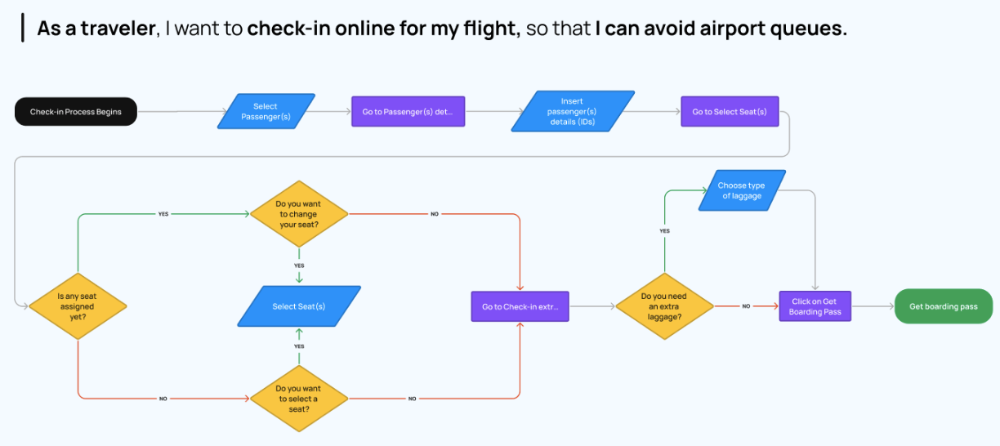

User flows visualize the paths users may take within an application, from entry to a final action.

**Summary:**

- Chart a user's journey within an application.
- Emphasize effortless navigation.
- Detail interactions and pathways.

**Goals:**

- Understand and enhance user pathways.
- Document all potential paths.

### User Flow vs. Task Flow

|                 **User Flow**                 |                 **Task Flow**                 |
| :-------------------------------------------: | :-------------------------------------------: |
|        Broad, potentially non-linear.         |            Linear, task-specific.             |
| 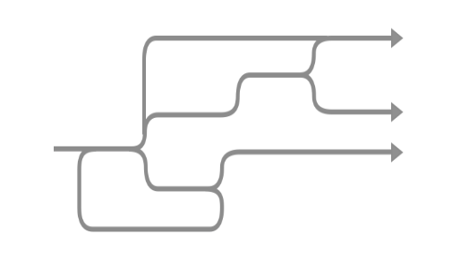 | 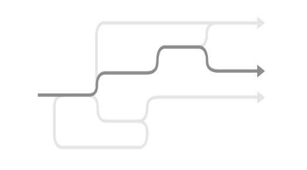 |

**User flows** are best during initial planning.
**Task flows** optimize specific tasks in established apps.

[Here is an example of a “forgot password” task flow](https://uxplanet.org/ux-glossary-task-flows-user-flows-flowcharts-and-some-new-ish-stuff-2321044d837d)

### Benefits of User Flows

- Shape and validate information architecture.
- Enhance user experience and task completion rates.
- Drive favorable outcomes.

### Constructing a User Flow

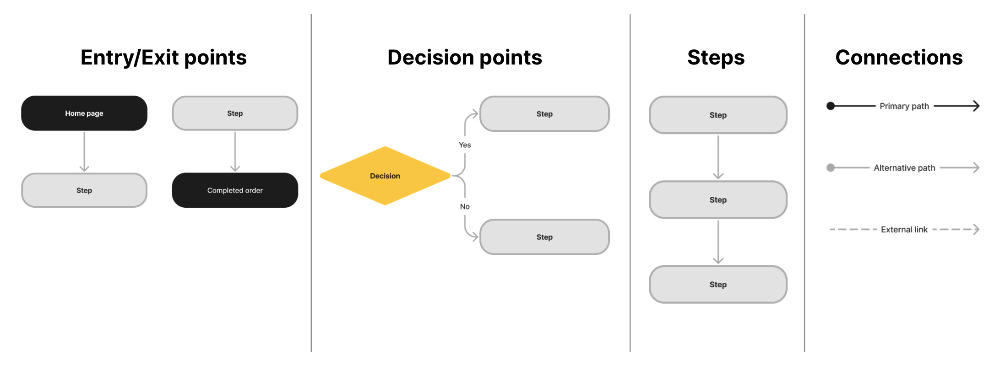

### Entry Points:

- Define user personas and objectives.
- Anticipate actions and guide with clear messages.

### Flow Mapping:

- Visualize potential flows.
- Document interconnected pathways.

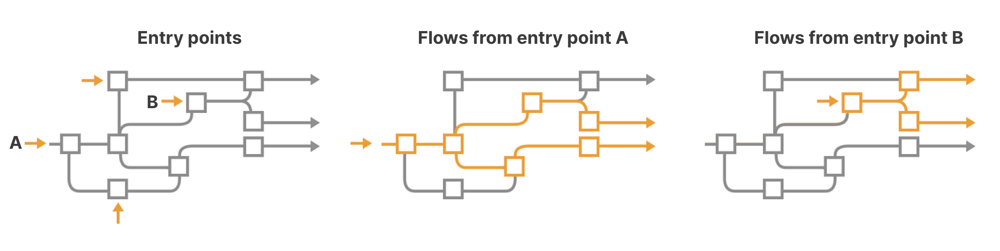

### Aligning Information Architecture with User Flow

Begin with user-centered Information Architecture (IA). Validate with user flows and refine based on insights.

## Class 2: Ideating with Wireframes

Review [Ideation and Prototyping module](https://mad9034.github.io/f2024/modules/week3/#learning-objectives).

## Wireframes

A wireframe is a visual guide depicting the structure of a website or app, aiding in the arrangement of elements to fulfill a specific purpose.

**Goals:**

- Explore, share, and communicate ideas.

### Wireflows

Wireflows combine wireframes with flowcharts, effectively connecting the app’s information architecture with its visual design.

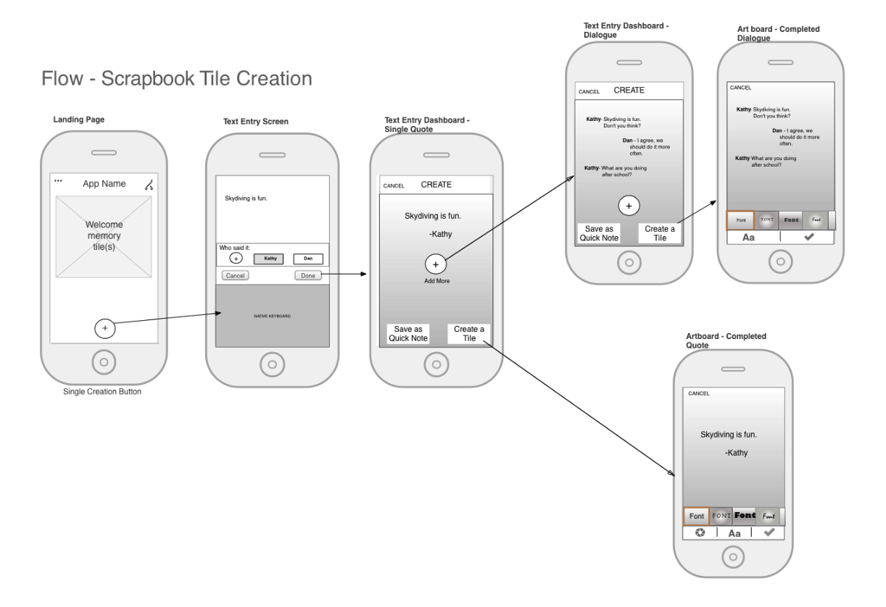

### Wireframe Fidelity

|           **Low-fidelity**            |           **Mid-fidelity**            |          **High-fidelity**          |
| :-----------------------------------: | :-----------------------------------: | :---------------------------------: |
|             Basic detail              |            Moderate detail            |              Detailed               |
| 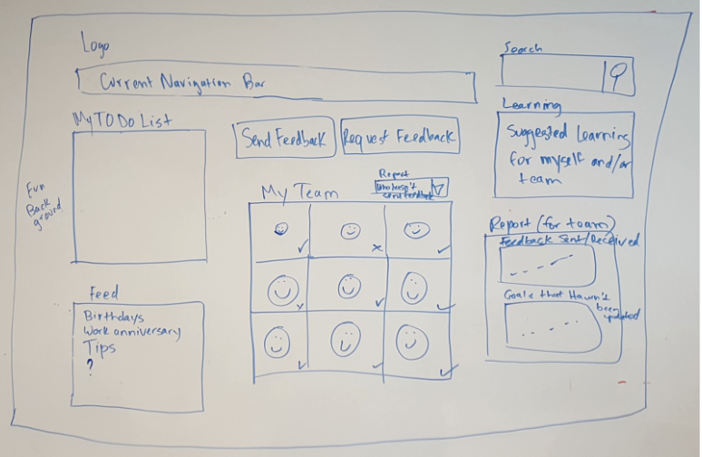 | 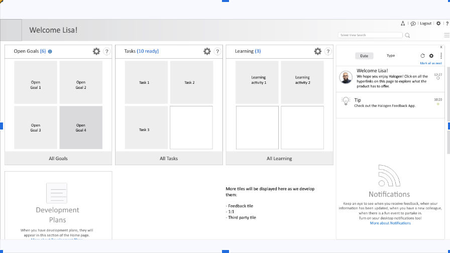 | 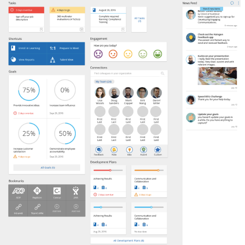 |

[How to Draw a Wireframe](https://www.nngroup.com/articles/draw-wireframe-even-if-you-cant-draw/)

### Mobile Design Patterns

Each design pattern discussed is collapsible for better organization and user experience:

### Mobile Design Patterns

 

<CollapsibleSection text="Principles for Mobile: objects">

#### Principles for Mobile: objects

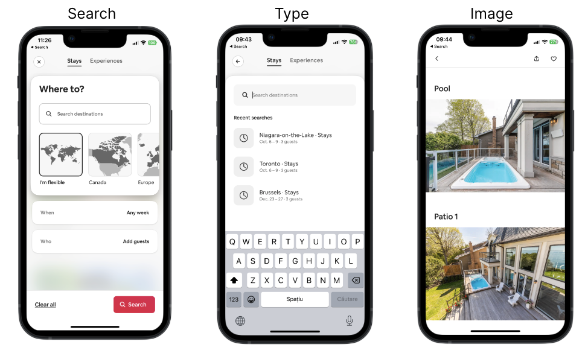

Different content types have their own properties, behaviours and interactions

- Search
- Type
- Image

</CollapsibleSection>

<CollapsibleSection text="Principles for Mobile: choices">

#### Principles for Mobile: choices

- Screens that give users choices and help them advance towards their goal.

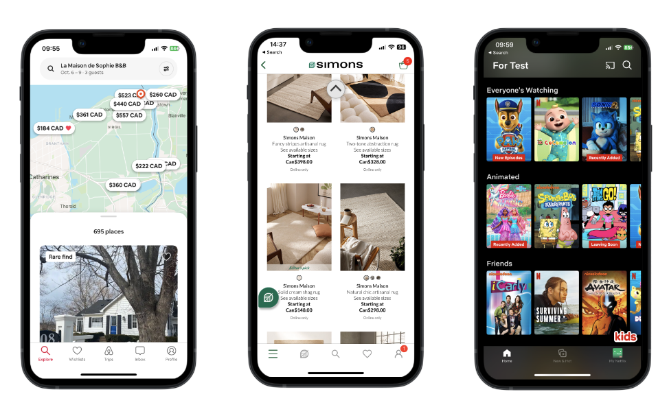

</CollapsibleSection>

<CollapsibleSection text="Principles for Mobile: progressive disclosure">

#### Principles for Mobile: progressive disclosure

- People cannot consume large amounts of data at once.
- Disclose content in layers, revealing information gradually.

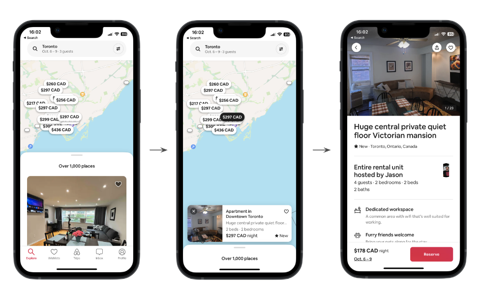

</CollapsibleSection>

<CollapsibleSection text="Principles for Mobile: exemplars, front doors, multiple classification">

#### Principles for Mobile: exemplars, front doors, multiple classification

- **Exemplars:** Provide examples through images, icons, lists, to illustrate the content in different categories.
- **Front doors:** For mobile sites, not native apps, expect users to come to your site in other ways than through the home page.
- **Multiple classification:** Provide multiple ways to navigate through content to meet different user needs.

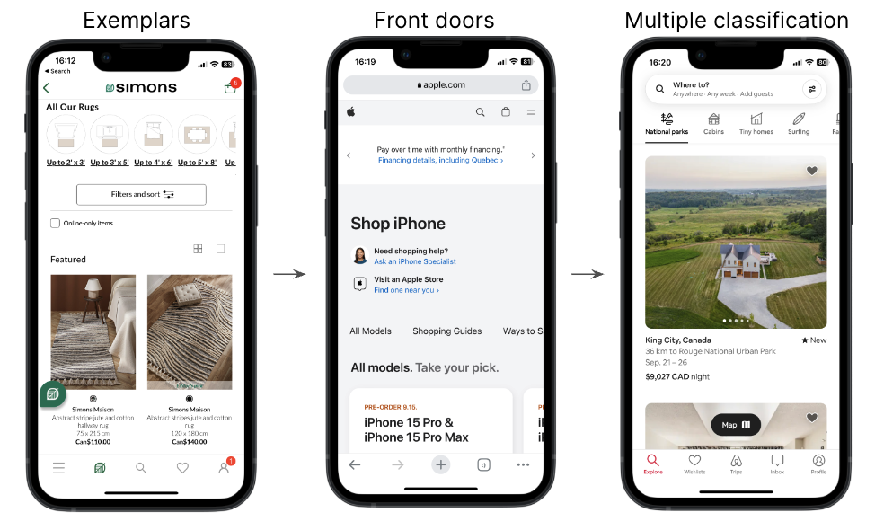

</CollapsibleSection>

<CollapsibleSection text="Principles for Mobile: focused navigation, growth">

#### Principles for Mobile: focused navigation, growth

- **Focused navigation:** Switch from side nav to top nav if the functionality warrants it. Define navigation by its functionality, not its location.
- **Growth:** Design for scale. Expect other content categories to be added in the future.

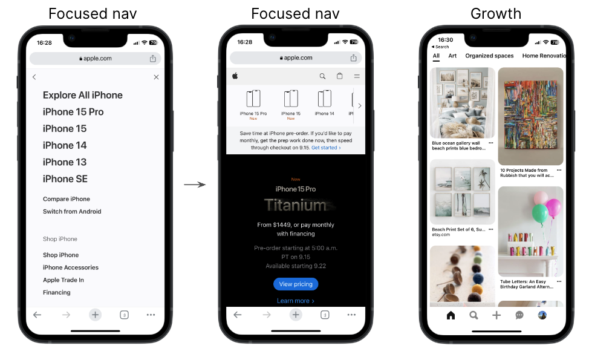

</CollapsibleSection>

## Navigation

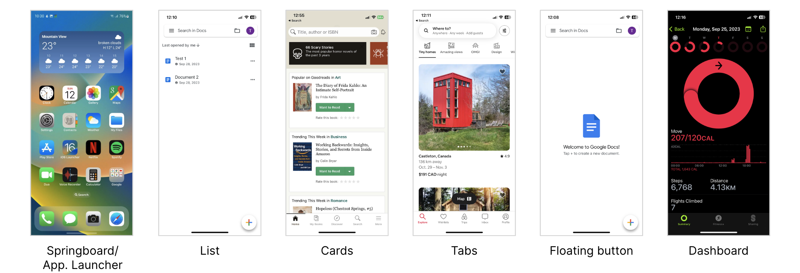

Effective navigation ensures users can easily understand and traverse a website or app.

**Goals:**

- Maintain user orientation.
- Provide quick access to main features.
- Prioritize vital information.

**References for Navigation Patterns:**

- [iOS Navigation Patterns](https://developer.apple.com/design/human-interface-guidelines/navigation-and-search)
- [Material Design (Android) Navigation Patterns](https://m1.material.io/patterns/navigation.html)
- [Nielsen-Norman Group Mobile Navigation Patterns](https://www.nngroup.com/articles/mobile-navigation-patterns/)
- [Navigation Examples to Be Aware of](https://www.uxpin.com/studio/blog/mobile-navigation-examples/)
- [Mobile Navigation: Patterns and Examples](https://www.justinmind.com/blog/mobile-navigation/)

## From Scenario to Wireframes

1. Understanding Scenarios
   A scenario provides a narrative of a user's interaction with a product. It details:

   - The user's motivations and goals.
   - The sequence of actions taken.
   - The context in which these actions occur.

   **Example Scenario:**
   John wants to purchase a new winter jacket. He's unsure about the style, so he logs into an e-commerce app, searches for "winter jackets," filters results based on customer reviews, selects a jacket, checks its details, adds it to his cart, and completes the purchase.

2. Translating Scenarios to User Flows
   Once the scenario is laid out, it can be transformed into a user flow, which maps the steps taken by the user.

   **John's User Flow:**

   1. Log into the app.
   2. Navigate to the search bar.
   3. Enter "winter jackets."
   4. Apply filter based on customer reviews.
   5. Select a jacket.
   6. View jacket details.
   7. Add to cart.
   8. Checkout and purchase.

3. Wireframing Each Step
   With the user flow in place, you can begin to draft wireframes for each step, detailing the layout and elements on the screen.
   **For John's Flow:**

   - **Login Screen:** Fields for username and password, 'login' button, 'forgot password' link.
   - **Search Screen:** A prominent search bar, past searches, popular searches.
   - **Results Screen:** List of jackets, filter options (like customer reviews), sorting options.
   - **Product Detail Screen:** Images of the jacket, product details, size options, 'add to cart' button.
   - **Cart Screen:** List of selected items, total price, 'checkout' button.
   - **Checkout Screen:** Payment details, delivery address, 'confirm purchase' button.

4. Connecting Screens Using User Flows
   User flows also highlight how screens are interlinked. For instance, after adding the jacket to the cart, John should have options to either continue shopping or proceed to checkout.

5. Iterative Feedback and Refinement
   Once initial wireframes are crafted, gather feedback, iterate, and refine. This ensures the final designs align with user needs and expectations.

6. Avoiding Common Pitfalls
    
   **Remember:**
   - Don't design in isolation. Always refer back to the scenario to ensure you're meeting the user's needs.
   - Make the flow as intuitive and simple as possible. Avoid unnecessary steps.
   - Ensure consistency across all screens for elements like buttons, fonts, and colors.
   - Be mindful of platform-specific design guidelines when crafting wireframes for different devices.

Moving from scenarios to wireframes is a structured process that ensures the final product aligns with the user's needs, providing a seamless and intuitive user experience.
