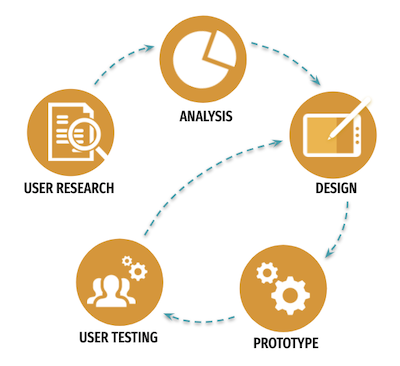

# MAD9034 - User Experience Design

::: tip Welcome to UXD

Going beyond the basics of graphics and user interface fundamentals, students learn how to combine these elements to create intuitive, efficient and enjoyable products. Students are introduced to a user-centered approach to designing mobile applications. Students begin with user research and build toward creating interaction design specifications in the form of wireframe documents. Topics such as information architecture, navigation and orientation, and interaction design principles are discussed and applied.

:::

## Course Description

- [Course Outline](https://ecoursemap.com/Outline?coursecode=MAD9034&courseversion=&academicyearid=121)
- Course Section Information (CSI) on Brightspace LMS

## Student Workload Expectations

- 4 hours/week (instructional activity)
- Two 2-hour classes per week
- 4 hours per week of tutorials/videos/exercises/studying/practicing outside class.

## Schedule

**Section 010:** two days :clock1:

- Tuesday 1pm - 3pm (Virtual)
- Thursday 1pm - 3pm 

**Section 020:** two days :clock7:

- Tuesday 7pm - 9pm 
- Thursday 6pm - 8pm (Virtual)

## User Experience Design Process

## Core Topics

- Design sprints
- User-centered design process
- Discovery & User research
- Synthesize research data
- Design
- Prototype
- User testing

## Course Policy

Students focus on how interfaces need to react to user expectations. Students apply best practices for navigation, interaction, use of colour and typography, designing for gesture-based interfaces, as well as a thorough study of effective user feedback. Designing effective interfaces that allow improved work flow is applied.

### Late Assignment Policy

10% deduction per day for the first 3 days (including weekend).
After 10 days (including weekend) of no submission, the student will receive a 0.

Students may still submit their assignments after the ten days but it will only be for the purpose of receiving feedback on their work. No grade will be given.

### Performance Requirement

::: danger

In-class work progress review is part of the performance assessment. A student must pass the combined term work (marked exercises and assignments) and score higher than 50% in all graded assignments, presentations, and projects to pass this course.

:::

### Copyright

This course complies with the college directives. Please complete **Plagiarism Declaration** [Section 010](https://brightspace.algonquincollege.com/d2l/le/content/474453/viewContent/7112658/View) / [Section 020](https://brightspace.algonquincollege.com/d2l/le/content/474453/Home)

## Contacts

<ContactCard 
  name="SuCheng Lee"
  title="Professor"
  img-url="/f2022/slee_h.png"
  bio="Professor of the Mobile Application Design & Development Program at Algonquin College"
  :details="[
      { label: 'email', value: 'lees1@algonquincollege.com' }, 
      { label: 'github', value: 'lees1' },  
      { label: 'office', value: 'Zoom - by appointment' },
      { label: 'twitter', value: '@UXResearchLab' },
    ]"
/>

<ContactCard 
  name="Laura Olac"
  title="Professor"
  img-url="/f2022/Laura-Olac.png"
  bio="Instructor in the Mobile Application Design & Development Program at Algonquin College."
  :details="[
      { label: 'email', value: 'olacl@algonquincollege.com' }, 
      { label: 'github', value: 'TBA' },  
      { label: 'office', value: 'Zoom - by appointment' },
      { label: 'twitter', value: 'TBA' },
    ]"
/>

<ContactCard 
  name="Admed Elbadri"
  title="Student Success Specialist"
  bio=""
  :details="[
      { label: 'email', value: 'elbadra@algonquincollege.com' }, 
      { label: 'phone', value: '(613) 727-4723 x‬2188' }, 
      { label: 'office', value: 'C037' }
    ]"
/>
